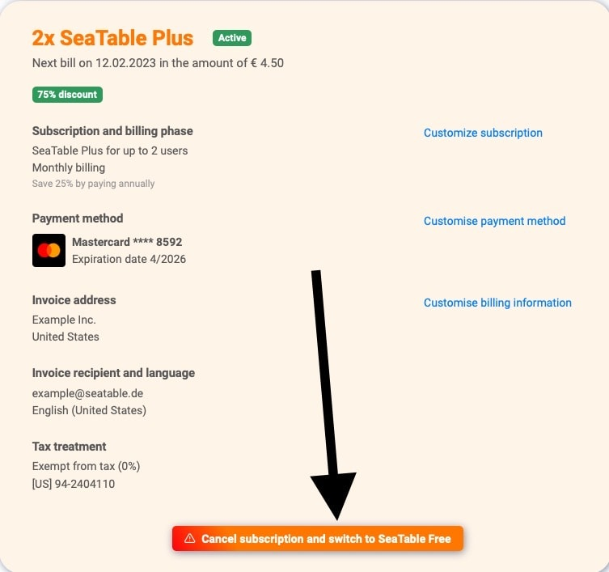

You want to cancel your SeaTable subscription? To do so, use the Subscription tab in Team administration. Please note, however, that the cancellation of existing subscriptions only takes effect at the end of the subscription period. You can still use your cancelled subscription to its full extent until this point is reached.

## Cancel subscription

2. Open the **Team administration**. 3. Click on **Subscription**. 4. Click **"Cancel subscription and switch to SeaTable Free"**. 5. Your subscription is now canceled at the **end of** the **term** you selected. You can still make full use of SeaTable until that time.

## Delete team completely

If you want to cancel not only your current subscription, but also your entire team, please read the help article [delete the entire team]().
