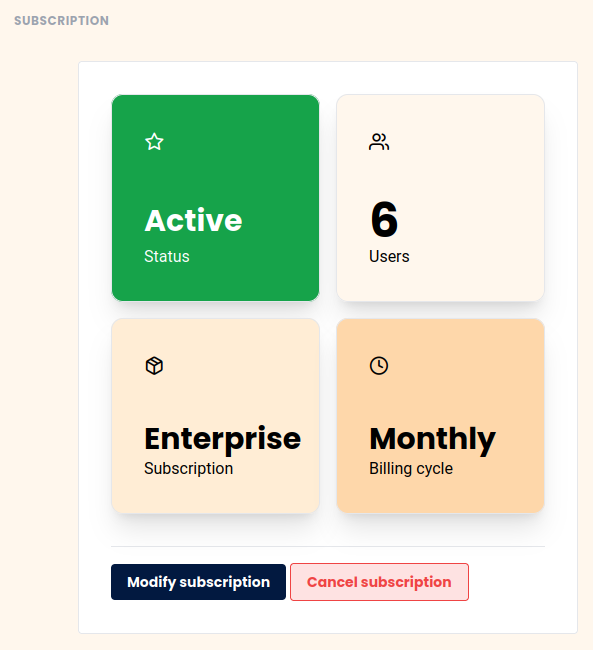

¿Desea cancelar su suscripción a SeaTable? Para ello, utilice la pestaña Suscripción de la administración del equipo. Tenga en cuenta, sin embargo, que la cancelación de las suscripciones existentes sólo surte efecto al final del plazo. Podrá seguir haciendo pleno uso de su abono cancelado hasta que se alcance este punto.

## Cancelar suscripción



1. Abre la **administración del equipo**. 
2. Haga clic en **Suscripción**.
3. Haga clic en **Cancelar suscripción** y luego confirme la cancelación.
    

4. Su suscripción ahora se cancelará al **final** del **período** seleccionado. Hasta ese momento, podrá seguir usando SeaTable completamente.

## Eliminar el equipo por completo

Si no sólo desea cancelar su suscripción actual, sino también eliminar todo su equipo, lea el artículo de ayuda [Eliminar todo el equipo]().
