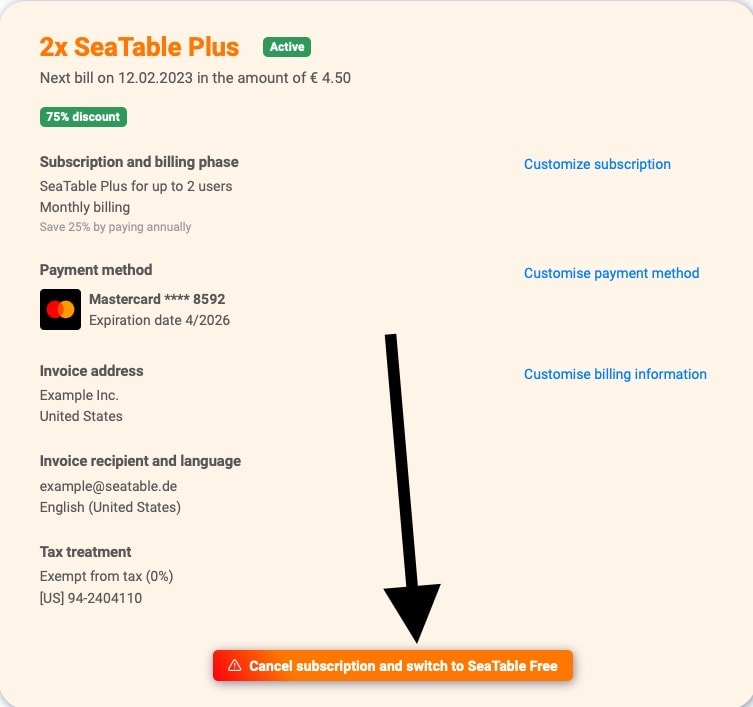

Вы хотите отменить подписку на SeaTable? Для этого воспользуйтесь вкладкой Subscription в администрировании команды. Однако обратите внимание, что отмена существующих подписок вступает в силу только в конце срока действия. Вы все еще можете в полной мере использовать отмененную подписку, пока не наступит этот момент.

## Отменить подписку


1. Откройте **администрацию команды**.
2. Нажмите на **Подписку**.
3. Нажмите на кнопку **"Отменить подписку и перейти на SeaTable Free"**.
4. Ваша подписка была отменена по **окончании** выбранного вами **срока**. До этой даты вы еще можете в полной мере использовать SeaTable.

## Удалить команду полностью

Если вы хотите не только отменить текущую подписку, но и удалить всю команду, пожалуйста, прочитайте справочную статью [Удалить всю команду]().
