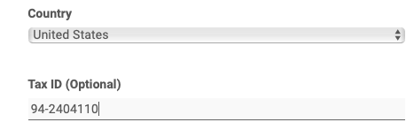
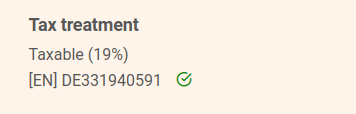



¿Desea almacenar una identificación fiscal en SeaTable? No hay problema, esto es posible en cualquier momento en unos pocos pasos a través de la administración del equipo.

## Depósito del NIF

El depósito del NIF es posible tanto al **reservar** un abono como **posteriormente.**

1. Abre la **administración del equipo**.
2. Pase a la sección **Suscripción**.
3. Haga clic en **"Ajustar la información de la factura"**.
4. Deposite un **número de identificación** fiscal en el campo previsto a tal efecto.
5. Guarde el cambio con **Modificar destinatario de** factura.

## Comprobación automática del NIF

Tras enviar el formulario, su NIF se comprueba automáticamente y se compara con la dirección que ha facilitado. La comprobación puede durar varios minutos.

Sólo cuando la verificación se haya realizado con éxito, el número de identificación fiscal será efectivo y podrá utilizarse en futuras facturas. Además, la previsión del importe de la factura futura sólo se ajusta cuando se ha comprobado que el NIF es válido.

## Preguntas frecuentes sobre el NIF



¿Está impreso el NIF en la factura?|||

Por supuesto. Si facilita un número de identificación fiscal, figurará en todas las facturas futuras.

---

¿No se acepta mi NIF?|||

Después de la entrada

---

¿Qué importancia tiene el número de identificación fiscal para el IVA?|||

El número de identificación fiscal influye en el cálculo del **IVA** para futuras facturas. **cálculo para** futuras facturas. Si el número de identificación fiscal es válido para una empresa no alemana, el IVA se reducirá al **0%.**


