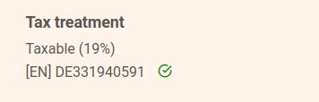



Vous souhaitez enregistrer un identifiant fiscal dans SeaTable ? Pas de problème, c'est possible à tout moment en quelques étapes via la gestion d'équipe.

## Déposer le numéro d'identification fiscale

Le dépôt du numéro d'identification fiscale est possible aussi bien lors de la **réservation** d'un abonnement qu'**ultérieurement**.

1. Ouvrez la **gestion d'équipe**.
2. Passez à la section **Abonnement**.
3. Cliquez sur **"Personnaliser les informations de facturation".**
4. Enregistrez un **numéro d'identification fiscale** dans le champ prévu à cet effet.
5. Enregistrez la modification en cliquant sur **Modifier le destinataire de la facture**.

## Vérification automatique du numéro d'identification fiscale

Après l'envoi du formulaire, votre numéro d'identification fiscale est automatiquement vérifié et comparé à l'adresse que vous avez indiquée. Cette vérification peut prendre plusieurs minutes.

Ce n'est qu'une fois la vérification effectuée avec succès que le numéro d'identification fiscale sera effectif et utilisé sur les futures factures. De même, l'aperçu du montant de la future facture ne sera adapté que lorsque l'ID fiscal aura été vérifié comme étant valable.

## Questions fréquentes sur le numéro d'identification fiscale



Le numéro d'identification fiscale est-il imprimé sur la facture ?|||

Bien entendu, cela va de soi. Si vous indiquez un numéro d'identification fiscale, celui-ci sera mentionné sur toutes les futures factures.

---

Mon numéro d'identification fiscale n'est pas accepté ?|||

Après la saisie

---

Quelle est l'importance du numéro d'identification fiscale pour la TVA ?|||

Le numéro d'identification fiscale influence le calcul **de la TVA.** Le **calcul** des futures factures. Si le numéro d'identification fiscale d'une entreprise non allemande est valide, la TVA est réduite à **0%**.


