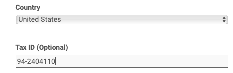



Вы хотите хранить налоговый идентификатор в SeaTable? Нет проблем, это возможно в любое время всего за несколько шагов через администрацию команды.

## Внесение налогового идентификатора

Внести налоговый идентификатор можно как при **бронировании** абонемента, так и **впоследствии**.

1. Откройте **администрацию команды**.
2. Перейдите в раздел **Подписка**.
3. Нажмите кнопку **"Скорректировать информацию о счете-фактуре"**.
4. Внесите **идентификатор налогоплательщика в** отведенное поле.
5. Сохраните изменения с помощью **Изменить получателя счета-фактуры**.

## Автоматическая проверка налогового идентификатора

После отправки формы ваш налоговый идентификатор автоматически проверяется и сравнивается с указанным вами адресом. Проверка может занять несколько минут.

Только после успешной проверки налоговый идентификатор вступит в силу и будет использоваться в будущих счетах-фактурах. Предварительный просмотр суммы будущего счета-фактуры также корректируется только после проверки достоверности идентификатора налогоплательщика.

## Часто задаваемые вопросы о налоговом идентификаторе

Конечно. Если вы предоставите идентификатор налогоплательщика, он будет указан во всех последующих счетах-фактурах.

После ввода

Налоговый идентификатор влияет на расчет **НДС** для будущих счетов-фактур. **расчет для** будущих счетов-фактур. Если налоговый идентификатор действителен для негерманской компании, НДС будет снижен до **0%**.


