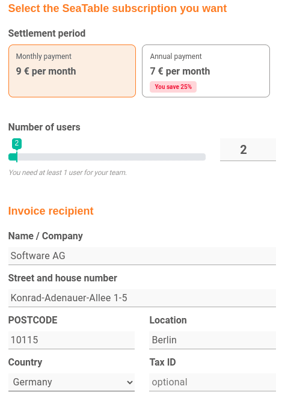

Your team has a SeaTable Free subscription and you want to upgrade to Plus or Enterprise? No problem! Just use the **Subscription** tab in **Team administration** and book your desired subscription package.

On the [Pricing]() page you can find an overview with all the subscription packages available in SeaTable and the features and capabilities they include.

## Book a Plus or Enterprise subscription



1. Open the **Team administration**.
2. Click on **Subscription**.
3. Click **Upgrade Now** under the subscription you want.
4. Fill out the **booking form.**

6. Confirm the booking with **Subscribe to SeaTable Plus/Enterprise**.

The booking takes place directly and your team has immediate access to the new functions and limits.

## Important booking information

- The **standard payment method** is payment by credit card. [Payment by invoice]() is only possible under certain conditions.
- The amount shown in the booking form below will be **charged to** you **directly** after the subscription is completed.
- Once the payment is made, your account will be **automatically** upgraded to the booked subscription.
