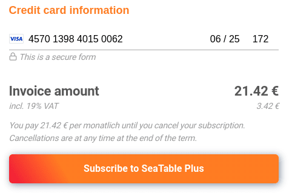

Votre équipe dispose d'un abonnement SeaTable Free et vous souhaitez passer à Plus ou Enterprise ? Pas de problème ! Pour cela, il vous suffit d'utiliser l'onglet **Abonnement** dans l'**administration d'équipe** et de réserver le pack d'abonnement de votre choix.

La page [Tarifs]() donne un aperçu de toutes les formules d'abonnement disponibles dans SeaTable et des fonctions et possibilités qu'elles incluent.

## Réserver un abonnement Plus ou Enterprise



1. Ouvrez l'**administration d'équipe**.
2. Cliquez sur **Abonnement**.
3. Cliquez sur **Mettre à niveau maintenant** sous l'abonnement souhaité.
4. Remplissez le **formulaire de réservation**.

6. Confirmez la réservation en cliquant sur **S'abonner à SeaTable Plus/Enterprise**.

La réservation se fait directement et votre équipe dispose immédiatement des nouvelles fonctions et limites.

## Informations importantes sur la réservation

- Le **mode de paiement standard** est le paiement par carte de crédit. Le [paiement sur facture]() n'est possible que sous certaines conditions.
- Le montant affiché dans le formulaire de réservation ci-dessous vous sera **directement facturé** après la conclusion de l'abonnement.
- Dès que le paiement a été effectué, votre compte est **automatiquement** mis à niveau vers l'abonnement réservé.
