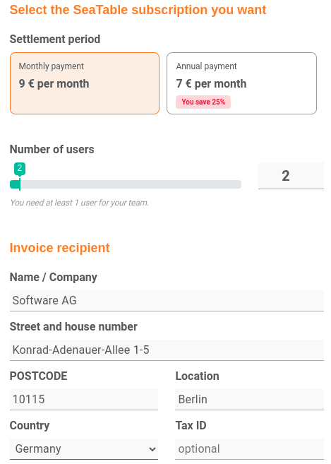
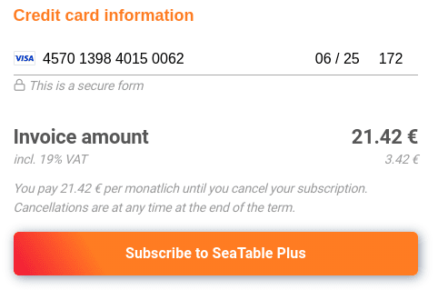

У вашей команды есть подписка SeaTable Free, и вы хотите перейти на Plus или Enterprise? Нет проблем! Просто воспользуйтесь вкладкой **Subscription** в **административном разделе команды** и забронируйте желаемый пакет подписки.

На странице ["Ценообразование"]() вы найдете обзор всех пакетов подписки, доступных в SeaTable, а также функции и опции, которые они включают.

## Подписка Book Plus или Enterprise



1. Откройте **администрацию команды**.
2. Нажмите на **Подписку**.
3. Нажмите кнопку **Upgrade now** под нужной подпиской.
4. Заполните **форму бронирования**.

6. Подтвердите бронирование с помощью программы **Subscribe to SeaTable Plus/Enterprise**.

Бронирование осуществляется напрямую, и новые функции и лимиты сразу же становятся доступны вашей команде.

## Важная информация о бронировании

- **Стандартный способ оплаты** - кредитная карта. [Оплата по счету-фактуре]() возможна только при определенных условиях.
- Сумма, указанная в приведенной ниже форме бронирования, будет **списана непосредственно** с вашего счета после завершения подписки.
- Как только оплата будет произведена, ваш аккаунт будет **автоматически** обновлен до забронированной подписки.
