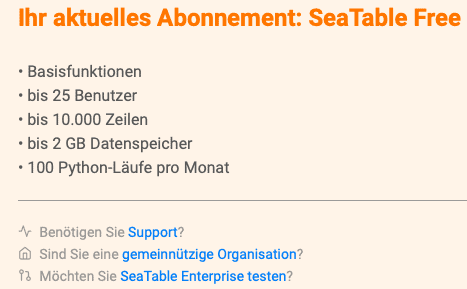

¿Le gustaría utilizar SeaTable y es usted una asociación registrada, trabaja en una institución pública o en una organización benéfica sin ánimo de lucro? Entonces disfrutará de ventajas especiales porque queremos apoyar a las personas que trabajan por el bien común, ya sea a través del trabajo social, la ayuda humanitaria, los proyectos ecológicos o la educación y la investigación.

SeaTable concede a las instituciones públicas un descuento del 25%, las organizaciones benéficas sin ánimo de lucro y las instituciones educativas reciben un descuento estándar del 50% y las asociaciones locales, en casos excepcionales, incluso hasta un 75% de descuento en su suscripción a SeaTable Plus o SeaTable Enterprise. Para beneficiarse del descuento, basta con presentar la correspondiente solicitud a través de la [administración del equipo](https://seatable.io/es/docs/teamverwaltung/die-funktionen-der-teamverwaltung-in-der-uebersicht/).

## Solicitar descuento

Si aún no has registrado un equipo en cloud.seatable.io, empieza por [registrarte](). Crea siempre primero un equipo con la [suscripción]() gratuita. A continuación, proceda como se indica a continuación:

1. Abre la [administración del equipo](https://account.seatable.io).
2. Pase a la sección **Suscripción**.
3. Haga clic en ¿Es **usted una organización sin ánimo de lucro?**
   
4. Rellene el **formulario** y haga clic en **Enviar solicitud**.

## Esperar la respuesta

Denos uno o dos días para comprobar su solicitud. Un representante de SeaTable se pondrá en contacto con usted. Si le concedemos el descuento, sólo tiene que actualizar su cuenta a través de la administración del equipo y el descuento se aplicará inmediatamente.
