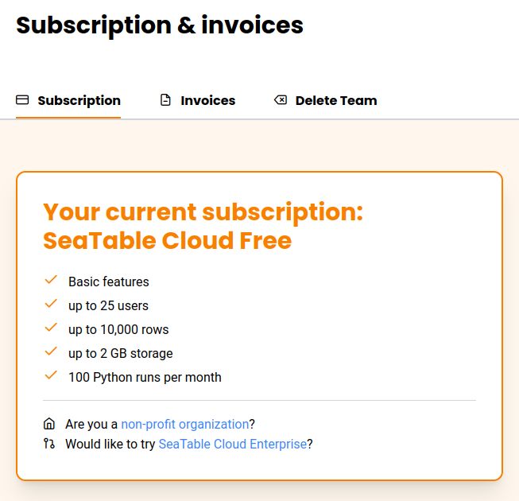

Vous souhaitez utiliser SeaTable et vous avez une association enregistrée, vous travaillez dans une institution publique ou une organisation à but non lucratif ? Dans ce cas, vous bénéficiez d'avantages particuliers, car nous souhaitons soutenir les personnes qui s'engagent pour le bien commun, que ce soit par le biais d'un travail social, d'une aide humanitaire, de projets écologiques ou de l'éducation et de la recherche.

SeaTable accorde les **réductions suivantes sur les abonnements SeaTable Plus ou SeaTable Enterprise** :

| Destinataire             | Réduction possible |
| ------------------------ | ------------------ |
| établissements publics   | 25% de réduction   |
| organisations non lucratives | 50% de réduction |
| établissements éducatifs | 50% de réduction   |
| clubs locaux             | 50% de réduction (jusqu'à 75% en situation exceptionnelle) |

Pour bénéficier de la réduction, soumettez simplement une demande via la [Gestion d'équipe]().

## Demander une réduction

Si vous n'avez pas encore enregistré d'équipe sur cloud.seatable.io, commencez par vous [inscrire](). Commencez toujours par créer une équipe avec l'[abonnement gratuit](). Ensuite, procédez comme suit :

1. Ouvrez [l'administration d'équipe](https://account.seatable.com).
2. Passez à la section **Abonnement**.
3. Cliquez sur **Êtes-vous une organisation à but non lucratif** ?
   
4. Remplissez le **formulaire** et cliquez sur **Envoyer la demande**.

## Attendre une réponse

Veuillez nous laisser un ou deux jours pour examiner votre demande. Un membre de l'équipe SeaTable vous contactera ensuite. Si nous vous accordons la remise, il vous suffira de mettre à niveau votre compte via l'administration de l'équipe et la remise sera immédiatement prise en compte.
