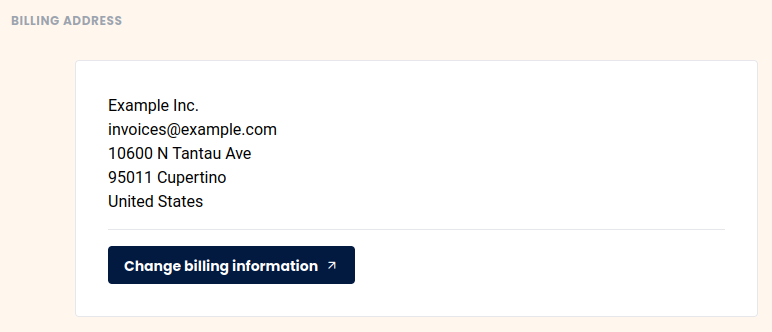



Sie möchten Ihre Rechnungsadresse ändern? Kein Problem, über die Teamverwaltung ist dies in nur wenigen Schritten erledigt.

## Rechnungsadresse anpassen



1. Öffnen Sie die **Teamverwaltung**. 
2. Klicken Sie auf **Abonnement**. 
3. Klicken Sie auf **"Rechnungsinformationen anpassen"**.
    

4. Hinterlegen Sie eine **neue** Rechnungsadresse. 
5. Speichern Sie Ihre Änderungen

## Häufige Fragen zur Rechnungsadresse

Wenn Sie Ihre Rechnungsadresse ändern, werden alle zukünftigen Rechnungen mit Ihrer neuen Rechnungsadresse erstellt.


Leider nein. Eine Änderung der Rechnungsadresse auf bereits erzeugten Rechnungen ist leider nicht möglich. In Ausnahmefällen können wir Ihnen eventuell eine neue Rechnung ausstellen, werden dafür aber in jedem Fall eine Bearbeitungsgebühr in Höhe von 10 € berechnen. Bitte schicken Sie uns eine entsprechende [Supportanfrage](https://account.seatable.com/support) mit der Rechnungsnummer und den genauen Änderungswünschen.

