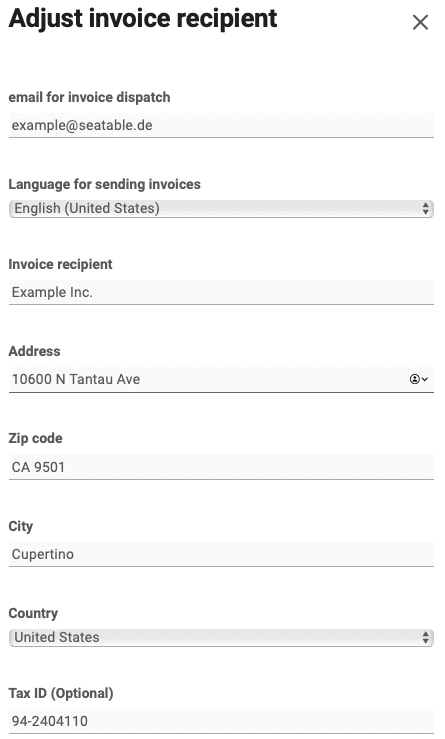



Vous souhaitez modifier votre adresse de facturation ? Pas de problème, grâce à l'administration d'équipe, cela se fait en quelques étapes.

## Adapter l'adresse de facturation

2. Ouvrez l'**administration d'équipe**. 3. Cliquez sur **Abonnement**. 4. Cliquez sur **"Personnaliser les informations de facturation".** 5. Enregistrez une **nouvelle** adresse de facturation. 6. Enregistrez la modification en cliquant sur **Modifier le destinataire de la facture**.

## Questions fréquentes sur l'adresse de facturation

Si vous modifiez votre adresse de facturation, toutes les futures factures seront établies avec votre nouvelle adresse de facturation.

Malheureusement, non. Il n'est malheureusement pas possible de modifier l'adresse de facturation sur des factures déjà générées. Dans des cas exceptionnels, nous pouvons éventuellement vous établir une nouvelle facture, mais nous vous facturerons dans tous les cas des frais de traitement d'un montant de 10 €. Veuillez nous envoyer une [demande d'assistance](https://account.seatable.io/support) correspondante avec le numéro de facture et les modifications précises souhaitées.


