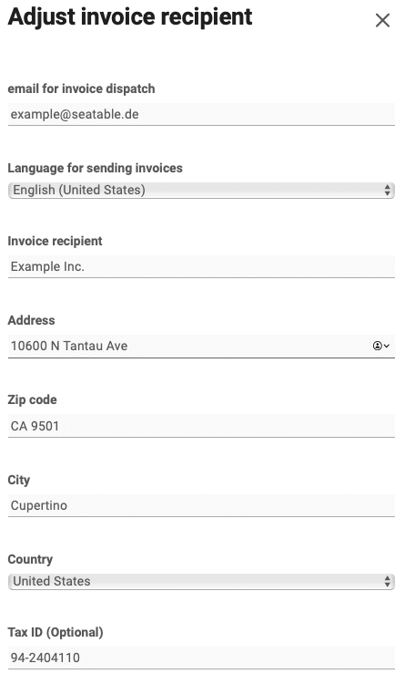



Вы хотите изменить свой адрес для выставления счетов? Нет проблем, это делается всего за несколько шагов через администрацию команды.

## Настройка адреса выставления счетов

2. Откройте **администрацию команды**. 3. Нажмите на **Подписку**. 4. Нажмите кнопку **"Скорректировать информацию о счете-фактуре"**. 5. Введите **новый** адрес для выставления счетов. 6. Сохраните изменения с помощью **Изменить получателя счета-фактуры**.

## Часто задаваемые вопросы об адресе выставления счетов

Если вы измените свой адрес выставления счетов, все последующие счета будут создаваться с вашим новым адресом выставления счетов.

К сожалению, нет. К сожалению, невозможно изменить адрес выставления счета на уже сформированных счетах. В исключительных случаях мы можем выписать вам новый счет, но в любом случае мы взимаем плату за обработку в размере 10 евро. Пожалуйста, отправьте нам соответствующий [запрос в службу поддержки](https://account.seatable.com/support) с указанием номера счета и точных запросов на изменения.


