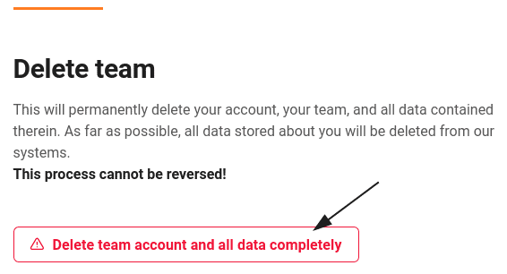
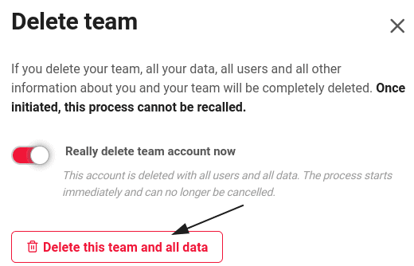

Los administradores de equipos tienen la opción de borrar su equipo en SeaTable a través de la administración de equipos.  
Este artículo explica las consecuencias de eliminar un equipo para los datos asociados.

## Borrar mi equipo



 4. Abre la **administración del equipo**. 5. Haga clic en **Suscripción**. 6. Haz clic en **"Eliminar completamente la cuenta del equipo y todos los datos"** en la parte inferior de la página. 7. Activa el **control deslizante** y confirma la eliminación con **"Eliminar este equipo y todos los datos"**. 8. A continuación, recibirá automáticamente un **mensaje** confirmando la eliminación de su cuenta de equipo.

## Consecuencias para sus datos

Si elimina su equipo como administrador del mismo, su **cuenta**, su **equipo** y **todos los** **datos** que contenga se eliminarán de **forma permanente** y **definitiva**. En la medida de lo posible, **todos los** datos almacenados sobre usted también se **eliminarán** de nuestros otros **sistemas**. Este proceso **NO puede** revertirse y los datos eliminados **NO pueden** recuperarse.

Nuestro sistema de facturación en particular es especial porque, una vez que usted ha registrado un pago, no podemos borrar todos sus datos. En principio, sin embargo, accederemos a su solicitud de supresión de datos e intentaremos eliminar la mayor cantidad posible de sus datos. Puede encontrar más detalles sobre el sistema que utilizamos en nuestra [política de protección de datos](https://seatable.io/es/datenschutz/).

**Antes de** eliminar un equipo, piense detenidamente si todavía necesita los datos de su equipo. Si no está seguro, es mejor [cancelar la suscripción]() y volver a la versión gratuita de SeaTable Cloud.
