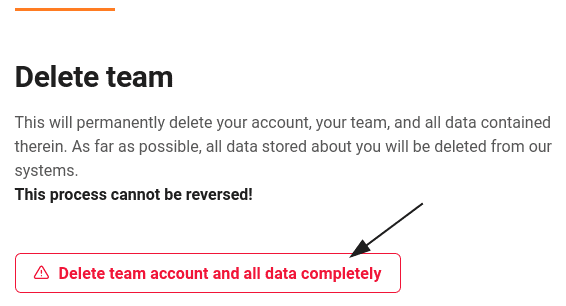
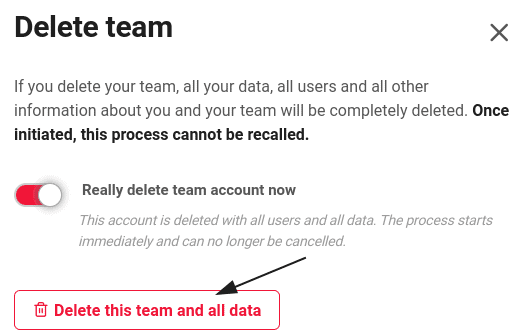

Администраторы команд имеют возможность удалить свою команду в SeaTable через администрацию команды.  
В этой статье объясняются последствия удаления команды для связанных с ней данных.

## Удалить мою команду



 4. Откройте **администрацию команды**. 5. Нажмите на **Подписку**. 6. В самом низу страницы нажмите кнопку **"Удалить учетную запись команды и все данные полностью"**. 7. Активируйте **ползунок** и подтвердите удаление командой **"Удалить эту команду и все данные"**. 8. После этого вы автоматически получите **сообщение**, подтверждающее удаление учетной записи вашей команды.

## Последствия для ваших данных

Если вы удалите свою команду как администратор команды, ваша **учетная запись**, ваша **команда** и **все** содержащиеся в ней **данные** будут **удалены** **навсегда** и **безвозвратно**. Насколько это возможно, **все** хранящиеся о вас данные будут также **удалены** из других наших **систем**. Этот процесс **не может** быть обращен вспять, и удаленные данные **не могут** быть восстановлены.

Наша биллинговая система особенна тем, что после того, как вы зарегистрировали платеж, мы не имеем права удалить все ваши данные. Однако в принципе мы выполним ваш запрос на удаление данных и постараемся удалить как можно больше ваших данных. Более подробную информацию об используемой нами системе вы можете найти в нашей [политике защиты данных]().

**Прежде чем** удалять команду, хорошо подумайте, нужны ли вам еще данные в команде. Если вы не уверены, лучше [отменить подписку]() и вернуться к бесплатной версии SeaTable Cloud.
