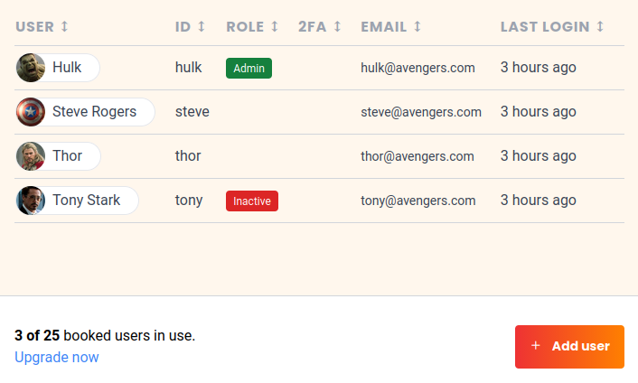

Um SeaTable in Ihrem Team nutzen zu können, muss für jeden Benutzer separat eine Lizenz erworben werden. Benutzer, die das Programm nicht mehr verwenden, können jedoch über den Reiter **Team** in der Teamverwaltung auf **inaktiv** gesetzt werden und zählen anschließend **nicht** mehr in die Anzahl an gebuchten Nutzern mit ein.

Alternativ können Sie auch einfach diesen Link benutzen:  
(Sie müssen natürlich in cloud.seatable.io eingeloggt sein)

[Zur Teamverwaltung](https://account.seatable.com/team)

## Benutzer auf inaktiv setzen

Das Sperren von Teammitgliedern (bzw. den Status auf Inaktiv setzen) haben wir in dem Hilfe-Artikel [Ein Teammitglied sperren oder löschen]() beschrieben.

## Inaktive Teammitglieder benötigen keine Lizenz 

Deaktivierte Benutzer erscheinen in der Team-Übersicht im Reiter **Team** stets mit einem roten Hinweis **Inaktiv**.

Inaktive Benutzer benötigen **keine Lizenz** und erhöhen nicht die Gesamtanzahl der gebuchten Nutzer.