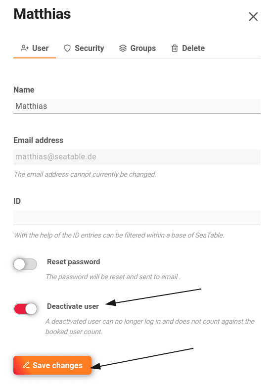

Pour pouvoir utiliser SeaTable dans votre équipe, vous devez acheter une licence pour chaque utilisateur séparément.  
Les utilisateurs qui n'utilisent plus le programme peuvent toutefois être rendus **inactifs** via l'onglet **Équipe** de la gestion d'équipe et ne seront alors **plus** comptabilisés dans le nombre d'utilisateurs réservés.

Vous pouvez aussi simplement utiliser ce lien :  
(vous devez bien sûr être connecté à cloud.seatable.io)

[Vers la gestion d'équipe](https://account.seatable.io/team)

## Rendre l'utilisateur inactif

2. Ouvrez la **gestion d'équipe**. 3. Cliquez sur **Équipe**. 4. Cliquez sur n'importe quel **utilisateur**. 5. **Activez** le **curseur** à côté de l'option **"Désactiver l'utilisateur".** 6. Cliquez sur **Enregistrer les modifications**.

Les utilisateurs désactivés apparaissent toujours dans l'aperçu de l'équipe sous l'onglet **Équipe** avec une indication rouge **Inactif**.

Les utilisateurs inactifs n'ont **pas** besoin de **licence** et n'augmentent pas le nombre total d'utilisateurs réservés.

