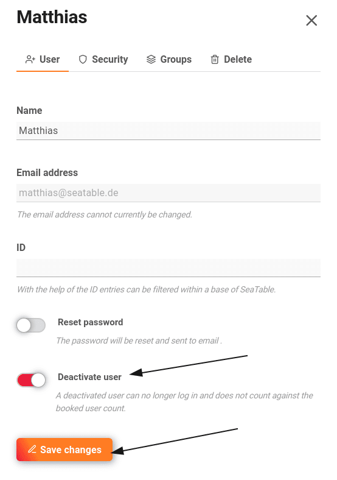
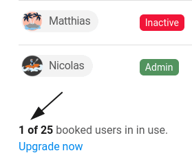

Для того чтобы использовать SeaTable в вашей команде, лицензия должна быть приобретена отдельно для каждого пользователя.  
Однако пользователи, которые больше не используют программу, могут быть переведены в **неактивное** состояние на вкладке " **Команда"** в административной части команды, и тогда их количество **не** будет учитываться при подсчете числа забронированных пользователей.

Кроме того, вы можете просто воспользоваться этой ссылкой:  
(разумеется, вы должны войти на cloud.seatable.io).

[Руководству команды](https://account.seatable.io/team)

## Перевести пользователя в неактивный режим

2. Откройте **администрацию команды**. 3. Нажмите кнопку **Команда**. 4. Нажмите на любого **пользователя**. 5. **Активируйте** **ползунок** рядом с пунктом **"Деактивировать пользователя"**. 6. Нажмите кнопку **Сохранить изменения**.

Деактивированные пользователи всегда отображаются в обзоре команды на вкладке **Команда** с красной пометкой **Неактивен**.

Неактивные пользователи **не** требуют **лицензии** и не увеличивают общее количество забронированных пользователей.

