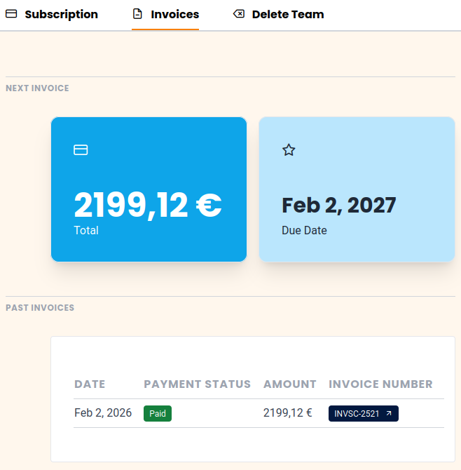

Ihre Rechnungen können Sie mit nur wenigen Klicks über die Teamverwaltung einsehen und herunterladen. Sie finden diese im Reiter Abonnement.

Alternativ können Sie auch einfach diesen Link benutzen:  
(Sie müssen natürlich in cloud.seatable.io eingeloggt sein)

[Zu Ihren Rechnungen](https://account.seatable.com/invoices)

## Rechnungen einsehen

1. Öffnen Sie die **Teamverwaltung**.
2. Klicken Sie auf **Abonnement**.
3. Klicken Sie auf **Rechnungen**.
4. Sie können sich nun alle **verfügbaren Rechnungen** anzeigen lassen. Zusätzlich sehen Sie den Rechnungsbetrag und das Rechnungsdatum der **nächsten Rechnung**.

## Download der Rechnung als PDF

In der Tabelle mit Ihren Rechnungen sind die Rechnungsnummern mit einem Link zu unserem Zahlungsdienstleister Stripe versehen.

Klicken Sie einfach auf die Rechnungsnummer und der Download der Rechnung als PDF-Dokument startet in Kürze.

## Automatischer Rechnungversand per E-Mail

Seit November 2025 bietet SeaTable auch die Option, dass Sie sich Ihre Rechnungen per E-Mail zuschicken lassen. Diese Optionen finden Sie auf der **Abonnement** Seite unter **Rechnungseinstellungen**.