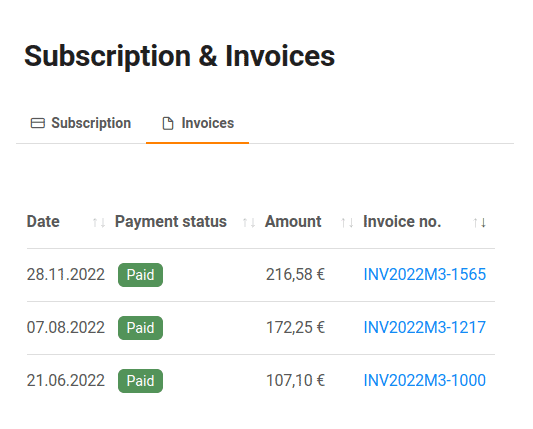

Vous pouvez consulter et télécharger vos factures en quelques clics via l'administration d'équipe. Vous les trouverez dans l'onglet Abonnement.

Vous pouvez aussi simplement utiliser ce lien :  
(vous devez bien sûr être connecté à cloud.seatable.io)

[Vers vos factures](https://account.seatable.io/subscription#tabs-subscription-2)

## Consulter les factures

1. Ouvrez l'**administration d'équipe**.
2. Cliquez sur **Abonnement**.
3. Cliquez sur **Factures**.
4. Vous pouvez maintenant afficher toutes les factures disponibles et les trier également par **statut de paiement**, **montant** ou **numéro de facture**.

## Télécharger la facture au format PDF

Dans le tableau de vos factures, les numéros de facture sont accompagnés d'un lien vers notre prestataire de services de paiement Stripe.

Il suffit de cliquer sur le numéro de la facture et le téléchargement de la facture au format PDF démarre sous peu.
