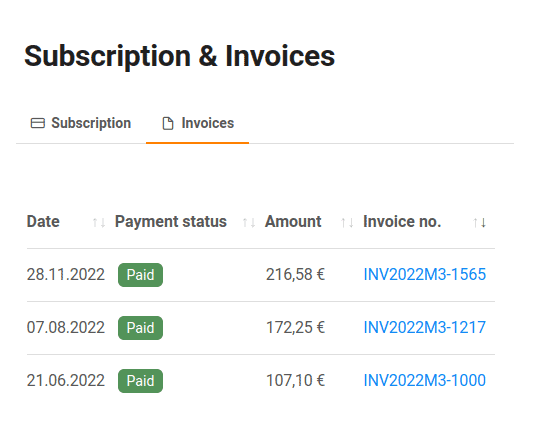

Вы можете просматривать и загружать свои счета-фактуры всего несколькими щелчками мыши через администрацию команды. Вы можете найти их на вкладке Подписка.

Кроме того, вы можете просто воспользоваться этой ссылкой:  
(разумеется, вы должны войти на cloud.seatable.io).

[К вашим счетам](https://account.seatable.com/subscription#tabs-subscription-2)

## Просмотр счетов-фактур

1. Откройте **администрацию команды**.
2. Нажмите на **Подписку**.
3. Нажмите на **Счета-фактуры**.
4. Теперь вы можете просматривать все имеющиеся счета-фактуры, а также сортировать их по **статусу оплаты**, **сумме** или **номеру счета-фактуры**.

## Скачать счет-фактуру в формате PDF

В таблице с вашими счетами-фактурами указаны номера счетов со ссылкой на нашего поставщика платежных услуг Stripe.

Просто нажмите на номер счета, и вскоре начнется загрузка счета в формате PDF.
