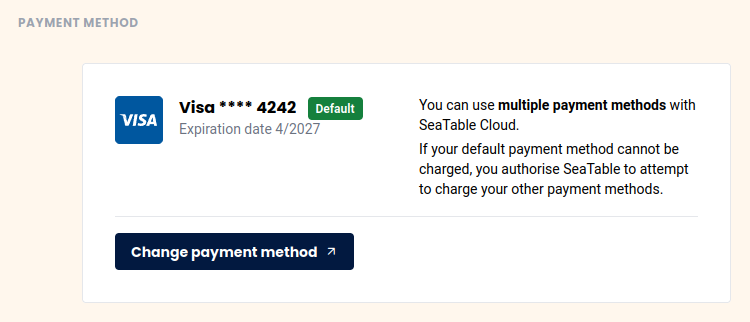



SeaTable bietet aktuell zwei Zahlungsmethoden an:

- Zahlung per Kreditkarte
- Zahlung auf Rechnung

Die Zahlung per **Kreditkarte** ist dabei die Bezahlmethode, die in den allermeisten Fällen zum Einsatz kommt. Dank unseres Zahlungsdienstleisters [Stripe](https://stripe.com) akzeptieren wir Zahlungen per Visa, Mastercard, American Express, China UnionPay, Discover, Diners und Cartes Bancaires.

Die zweite mögliche Zahlungsmethode stellt die **Bezahlung auf Rechnung** dar, die hingegen nur unter bestimmten Voraussetzungen möglich ist. Welche dies sind, erfahren Sie im Hilfeartikel [Bezahlung per Rechnung]().

## Wie kann ich sehen, welche Zahlungsmethode derzeit verwendet wird?

1. Öffnen Sie die **Teamverwaltung**.
2. Klicken Sie auf **Abonnement**.
3. Unter dem Punkt "**Bezahlmethode"** können Sie Ihre aktuelle Zahlungsmethode einsehen.

## Wie kann ich meine Zahlungsmethode ändern?

An der gleichen Stelle an der Sie Ihre Bezahltmethode in der Teamverwaltung sehen, können Sie diese auch bearbeiten. Klicken Sie auf **Bezahlmethode anpassen** und nehmen Sie die gewünschten Änderungen vor. 

Sie können z.B. eine **neue oder weitere Kreditkarte** als Zahlungsmethode hinterlegen. 

## Umstellung auf Zahlung auf Rechnung

Wie und unter welchen Vorraussetzungen Sie die **Bezahlung auf Rechnung** aktivieren können, erfahren Sie in diesem [Artikel]().
