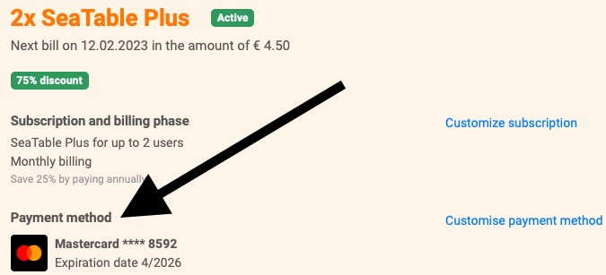



SeaTable currently offers two payment methods. Payment by **credit card** is the payment method that is used in the vast majority of cases. Thanks to our payment service provider [Stripe](https://stripe.com), we accept payments by Visa, Mastercard, American Express, China UnionPay, Discover, Diners and Cartes Bancaires.

The second possible payment method is **payment** by invoice, which is only possible under certain conditions. You can find out what these are in the help article [Payment by invoice]().

## How can I see which payment method is currently being used?

1. Open the **team management**.
2. Click on **Subscription**.
3. You can view your current payment method under "**Payment method"**.

## How can I change my payment method?

1. Open the **team management**.
2. Click on **Subscription**.
3. Click on **"Customize payment method"**.
4. You can now add a **new credit card** as a payment method. You can find out how and under what conditions you can activate **payment by invoice** in this [article]().

