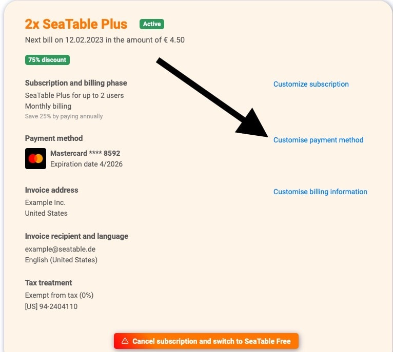



SeaTable propose actuellement deux méthodes de paiement. Le paiement **par carte de crédit** est le mode de paiement le plus courant. Grâce à notre prestataire de services de paiement [Stripe](https://stripe.com), nous acceptons les paiements par Visa, Mastercard, American Express, China UnionPay, Discover, Diners et Cartes Bancaires.

Le deuxième mode de paiement possible est le **paiement sur facture**, qui n'est toutefois possible que sous certaines conditions. Pour connaître ces conditions, consultez l'article d'aide [Paiement par facture](https://seatable.io/fr/docs/abo-abrechnung/bezahlung-per-rechnung/).

## Comment puis-je voir quel mode de paiement est actuellement utilisé ?

1. Ouvrez la **gestion d'équipe**.
2. Cliquez sur **Abonnement**.
3. Sous le point "**Mode de paiement"**, vous pouvez consulter votre mode de paiement actuel.

## Comment puis-je modifier mon mode de paiement ?

1. Ouvrez la **gestion d'équipe**.
2. Cliquez sur **Abonnement**.
3. Cliquez sur **"Personnaliser le mode de paiement".**
4. Vous pouvez maintenant enregistrer une **nouvelle carte de crédit** comme mode de paiement. Cet [article](https://seatable.io/fr/docs/abo-abrechnung/bezahlung-per-rechnung/) vous explique comment et sous quelles conditions vous pouvez activer le **paiement sur facture**.

