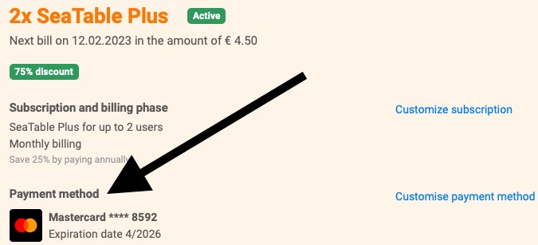
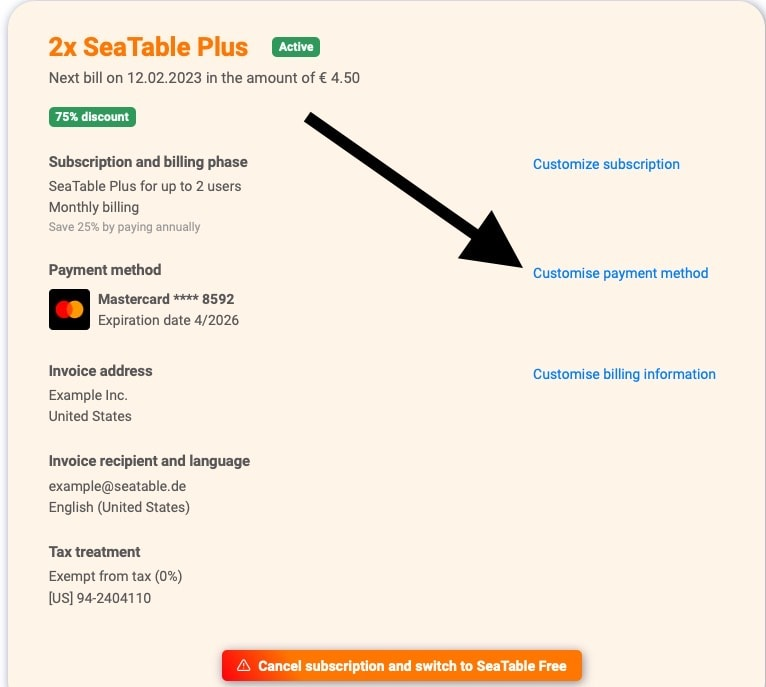



В настоящее время SeaTable предлагает два способа оплаты. Оплата **кредитной картой** - это способ оплаты, используемый в подавляющем большинстве случаев. Благодаря поставщику платежных услуг [Stripe](https://stripe.com) мы принимаем платежи по картам Visa, Mastercard, American Express, China UnionPay, Discover, Diners и Cartes Bancaires.

Второй возможный способ оплаты - **оплата по счету**, которая возможна только при определенных условиях. О том, что это за условия, вы можете узнать в справочной статье [Оплата по счету](https://seatable.io/ru/docs/abo-abrechnung/bezahlung-per-rechnung/).

## Как я могу увидеть, какой способ оплаты используется в настоящее время?

1. Откройте **администрацию команды**.
2. Нажмите на **Подписку**.
3. Посмотреть текущий способ оплаты можно в пункте**"Способ оплаты"**.

## Как я могу изменить способ оплаты?

1. Откройте **администрацию команды**.
2. Нажмите на **Подписку**.
3. Нажмите на кнопку **"Настроить способ оплаты"**.
4. Теперь вы можете добавить **новую кредитную карту** в качестве способа оплаты. В этой [статье](https://seatable.io/ru/docs/abo-abrechnung/bezahlung-per-rechnung/) объясняется, как и при каких условиях вы можете активировать **оплату по счету**.

