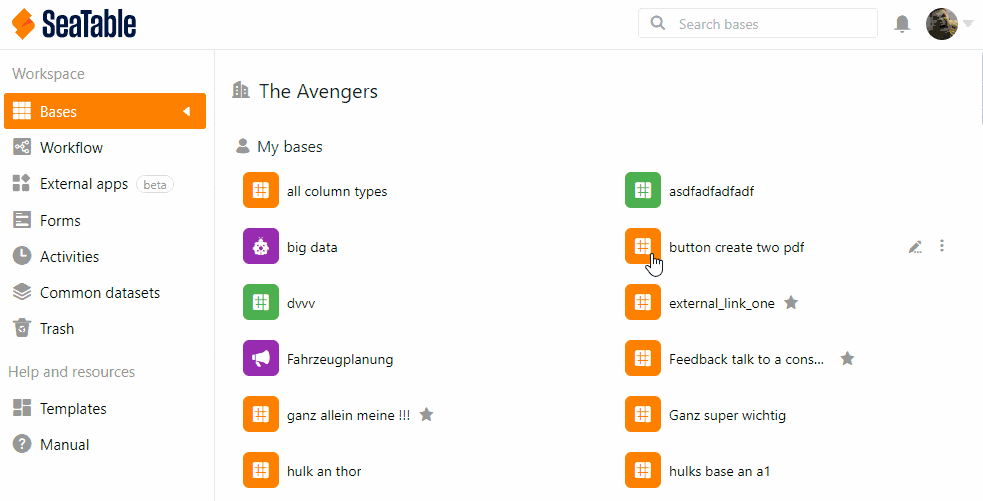

In **Team Management**, you can view all **access permissions** for a Base to keep track of who can see or edit the data.

## Viewing the access permissions

1. Click your **avatar image** in the upper right corner.
2. Select **Team Management** from the drop-down menu.
3. Go to **Bases** on the left side under **Navigation**.
4. Click the base whose **access information** you want to view.
5. Select the **Access** option under the heading. Here you can see all the access authorized persons and their rights.
