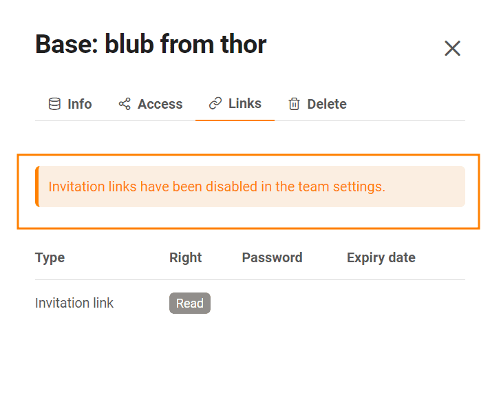

Un [lien d'invitation](https://seatable.io/fr/docs/freigabelinks/einladungs-link-erklaert/) vous permet d'accorder des **droits de lecture et d'écriture** sur une **base** à des personnes extérieures à votre équipe, mais qui doivent se connecter à SeaTable.

Pour savoir comment créer un lien d'invitation, [cliquez ici](https://seatable.io/fr/docs/freigabelinks/einladungs-link-erklaert/). Comme le lien peut être copié et retransmis à volonté, il est judicieux de définir un mot de passe et une date d'expiration comme **mesures de protection**.

Dans la **gestion d'équipe**, vous pouvez [voir](https://seatable.io/fr/docs/teamverwaltung/bases-in-der-teamverwaltung/) une [liste de tous les liens d'invitation pour une base](https://seatable.io/fr/docs/teamverwaltung/bases-in-der-teamverwaltung/). De plus, en tant qu'**administrateur d'équipe**, vous pouvez (dé)activer la fonction du lien d'invitation pour les autres membres de l'équipe. Ainsi, vous empêchez ou permettez que les membres de l'équipe puissent eux-mêmes partager des bases avec des tiers externes.

## Pour autoriser le partage de bases via un lien d'invitation, procédez comme suit

1. Passez à la **gestion d'équipe**.
2. Cliquez sur l'option de menu **Équipe**.
3. Cliquez sur la catégorie **Paramètres**.
4. Activez ici le curseur **Autoriser le partage des bases par lien d'invitation**.

## Effets de la fonction active de lien d'invitation

Si vous autorisez le partage des bases par lien d'invitation, les membres de votre équipe peuvent créer **autant de liens d'invitation qu'** ils le souhaitent et les envoyer à des personnes extérieures à l'équipe, qui peuvent utiliser ces liens pour consulter ou même modifier les bases concernées.

Un lien d'invitation peut en outre être **reproduit** à l'infini et donne également **accès au contenu de la base** à toute personne ayant accès à ce lien. Si vous souhaitez limiter cette option de partage, désactivez le curseur **Autoriser le partage des bases par lien d'invitation**. Pour les liens, vous verrez le message suivant :

Tous les **liens d'invitation** créés précédemment par l'équipe **ne fonctionneront** **plus**. Vous pouvez toujours créer des liens d'invitation, mais le destinataire n'aura pas accès à la base.


