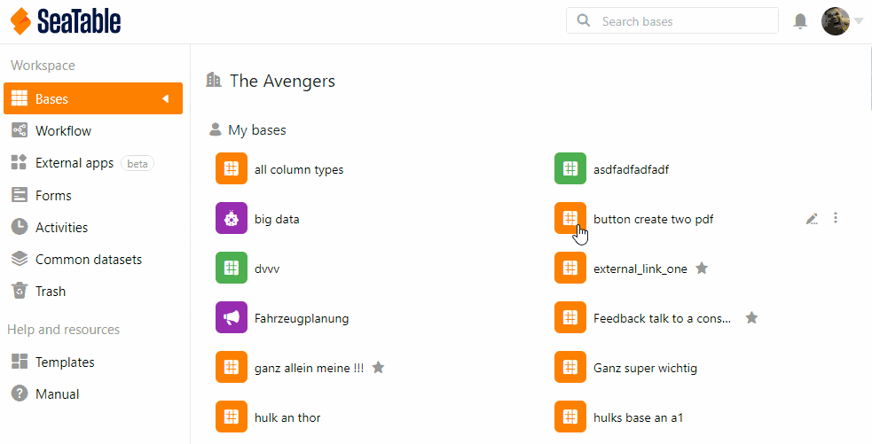

En la **administración del equipo**, puede ver todos los **permisos de acceso** de una base para controlar quién puede ver o editar los datos.

## Ver los permisos de acceso

1. Haz clic en la **imagen de** tu **avatar** en la esquina superior derecha.
2. Seleccione **Gestión de equipos** en el menú desplegable.
3. Vaya a **Bases** en el lado izquierdo bajo **Navegación**.
4. Haga clic en la base cuya **información de acceso** desea consultar.
5. Seleccione la opción **Acceso** bajo el encabezamiento. Aquí puede ver todas las personas autorizadas a acceder y sus derechos.
