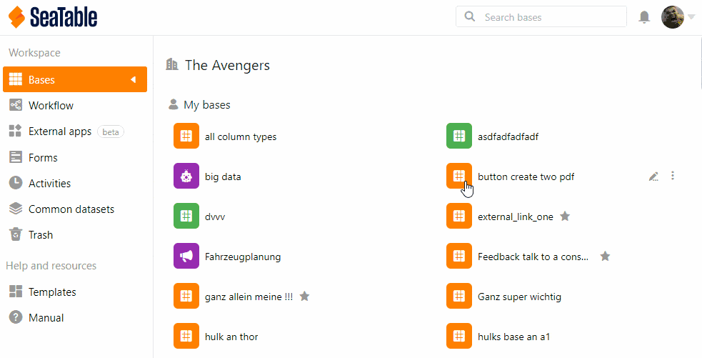

Na **administração da equipa**, pode visualizar todas as **permissões de acesso** a uma base para acompanhar quem pode ver ou editar os dados.

## Ver as permissões de acesso

1. Clique na **imagem do** seu **avatar** no canto superior direito.
2. Seleccione **Gestão de Equipas** a partir do menu pendente.
3. Ir para **Bases** do lado esquerdo em **Navegação**.
4. Clique na base cuja **informação de acesso** pretende visualizar.
5. Seleccione a opção de **Acesso** sob o título. Aqui pode ver todas as pessoas autorizadas a aceder e os seus direitos.
