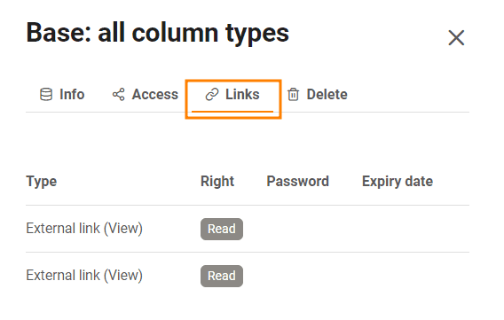

Wenn Sie **Team-Administrator** sind, haben Sie über die **Teamverwaltung** Zugriff auf alle Bases in Ihrem Team. Sie können die Detailansicht der einzelnen Bases aufrufen, Freigaben und Links der Bases einsehen oder Bases löschen.

## So greifen Sie auf die Bases in der Teamverwaltung zu

1. Klicken Sie auf Ihr **Avatar-Bild** in der rechten oberen Ecke.
2. Wählen Sie im Drop-down-Menü die Option **Teamverwaltung** aus.
3. Gehen Sie auf der linken Seite unter **Navigation** auf **Bases**.
4. Klicken Sie auf eine **Base**, um mehr Informationen und Optionen zur jeweiligen Base zu erhalten.

## Was Sie in der Detailansicht einer Base sehen können

### Info-Bereich

Hier können Sie folgende **Informationen** auslesen:

- Name der Base
- Base-ID
- Erstellungsdatum
- Besitzer der Base
- Anzahl der Zeilen innerhalb der Base

Sie können die ausgewählte **Base exportieren**, indem Sie auf den entsprechenden Button klicken.

### Zugriff

Hier können Sie alle **Mitglieder** sehen, die auf diese Base **Zugriff** haben und ob diese über **Lese- oder Schreibrechte** verfügen.

### Links

Bei **Links** können Sie alle Links sehen, die für die ausgewählte Base generiert wurden.

### Löschen

Unter **Löschen** haben Sie die Möglichkeit, die ausgewählte Base zu löschen.

## Der Papierkorb

Im Papierkorb sind alle **gelöschten Bases** aufgelistet. Nach **30 Tagen** werden die Bases automatisch aus dem System entfernt. Sie haben aber auch die Möglichkeit, manuell **alle Bases im Papierkorb endgültig zu löschen**. Wie das geht, erfahren Sie [hier](https://seatable.io/docs/teamverwaltung/den-papierkorb-in-der-teamverwaltung-leeren/).

Um eine Base wiederherzustellen, klicken Sie auf die jeweilige Base und betätigen den Regler, bevor Sie auf den Button **Base wiederherstellen** klicken.

## Freigaben

Hier sind die **Benutzer- und Gruppenfreigaben** für alle Bases aufgelistet. Sie können sehen, **an wen** eine Base freigegeben wurde und welche **Rechte** die Empfänger der Freigabe haben. 

Erfahren Sie in folgenden Artikeln mehr über die Freigabetypen:

- [Freigabe einer Base an eine Gruppe](https://seatable.io/docs/freigabelinks/freigabe-einer-base-an-eine-gruppe/)
- [Anlegen einer Benutzerfreigabe](https://seatable.io/docs/freigabelinks/anlegen-einer-benutzerfreigabe/)
- [Benutzerdefinierte Freigabe erstellen](https://seatable.io/docs/berechtigungen/benutzerdefinierte-freigabe-erstellen/)

## Externe Links und Einladungs-Links

In diesen beiden Übersichten können Sie nicht nur alle externen und Einladungs-Links sehen, sondern auch **wie häufig** diese **aufgerufen** wurden, welche **Rechte** sie den Empfängern geben, **wann** sie erstellt wurden, ob sie **passwortgeschützt** oder schon **abgelaufen** sind.

Mehr Informationen zu den Freigabelinks finden Sie in den folgenden Artikeln:

- [Einladungs-Link erstellen]()
- [Externen Link für eine Base erstellen](https://seatable.io/docs/freigabelinks/externer-link-erklaert/)
- [Unterschiede zwischen Einladungs-Links und externen Links](https://seatable.io/docs/freigabelinks/unterschiede-zwischen-einladungs-links-und-externen-links/)
