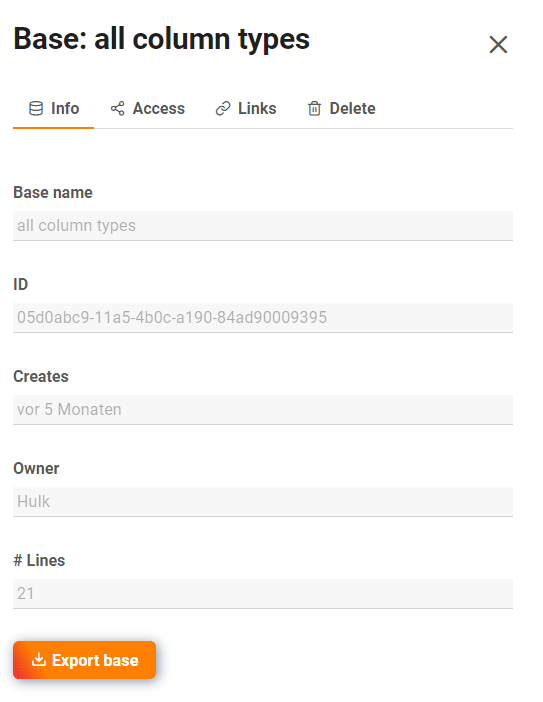

If you are a **team administrator**, you can access all the bases in your team through the **team administration**. You can view the details of each base, see base shares and links, or delete bases.

## How to access the bases in the team administration

1. Click your **avatar image** in the upper right corner.
2. Select the **Team administration** option from the drop-down menu.
3. Go to **bases** on the left side under **Navigation**.
4. Click on a **base** to get more information and options about that base.

## What you can see in the detailed view of a base

### Info area

Here you can read out the following **information**:

- Base name
- Base ID
- Creation date
- Base owner
- Number of rows within base

You can **export** the selected **base** by clicking the corresponding button.

### Access

Here you can see all **members** who have **access to** this base and whether they have **read or write permissions**.

### Links

In **Links** you can see all links generated for the selected base.

### Delete

Under **Delete** you have the option to delete the selected base.

## Trash

All **deleted bases** are listed in the trash. After **30 days**, the bases are automatically removed from the system. However, you can also **delete all** bases in the trash manually. You can find out how to do this [here]().

To restore a base, click the respective base and operate the slider before clicking the **Restore base** button.

## Share

Here are the **User and group shares** listed for all bases. You can see **with whom** a base was shared and which **Right** have the recipients of the share.



Learn more about the share types in the following articles:

- [Share a base with a group]()
- [Share a base with a user]()
- [Create a custom sharing permission]()

## External links and invitation links

In these two overviews you can see not only all external and invitation links, but also **how often** they were **called**, what **rights** they give to recipients, **when** they were created, whether they are **password protected** or have already **expired**.

You can find more information about the share links in the following articles:

- [Create invitation link]()
- [Create an external link for a base]()
- [Differences between invitation links and external links]()
