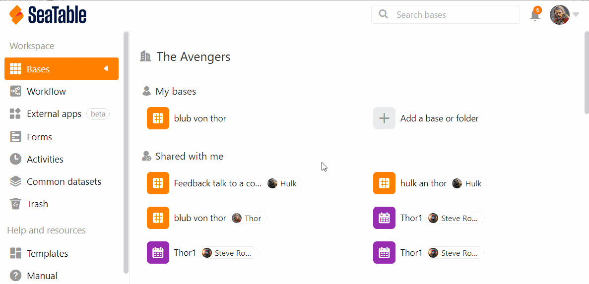

If you are a **team administrator**, you can access all the bases in your team through the **Team Administration**. You can view the details of each base, see base shares and links, or delete bases.

## How to access the bases in the team administration

1. Click your **avatar image** in the upper right corner.
2. Select the **Team Management** option from the drop-down menu.
3. Go to **Bases** on the left side under **Navigation**.
4. Click on a **Base** to get more information and options about that Base.

## What you can see in the detailed view of a Base

### Info area

Here you can read out the following **information**:

- Base name
- Base ID
- Creation date
- Base owner
- Number of rows within Base

You can **export** the selected **base** by clicking the corresponding button.

### Access

Here you can see all **members** who have **access to** this base and whether they have **read or write permissions**.

### Links

In **Links** you can see all links generated for the selected base.

### Delete

Under **Delete** you have the option to delete the selected Base.

## The trash

All **deleted bases** are listed in the recycle bin. After **30 days**, the bases are automatically removed from the system. However, you can also **delete all** bases in the recycle bin manually. You can find out how to do this [here](https://seatable.io/en/docs/teamverwaltung/den-papierkorb-in-der-teamverwaltung-leeren/).

To restore a base, click the respective base and operate the slider before clicking the **Restore Base** button.

## Releases

Here are the **User and group sharing** listed for all bases. You can see **To whom** a base was released and which **Right** have the recipients of the release.



Learn more about the release types in the following articles:

- [Releasing a Base to a Group](https://seatable.io/en/docs/freigabelinks/freigabe-einer-base-an-eine-gruppe/)
- [Create a user share](https://seatable.io/en/docs/freigabelinks/anlegen-einer-benutzerfreigabe/)
- [Create custom share](https://seatable.io/en/docs/berechtigungen/benutzerdefinierte-freigabe-erstellen/)

## External links and invitation links

In these two overviews you can see not only all external and invitation links, but also **how often** they were **called**, what **rights** they give to recipients, **when** they were created, whether they are **password protected** or have already **expired**.

You can find more information about the share links in the following articles:

- [Create invitation link](https://seatable.io/en/docs/freigabelinks/einladungs-link-erklaert/)
- [Create an external link for a base](https://seatable.io/en/docs/freigabelinks/externer-link-erklaert/)
- [Differences between invitation links and external links](https://seatable.io/en/docs/freigabelinks/unterschiede-zwischen-einladungs-links-und-externen-links/)
