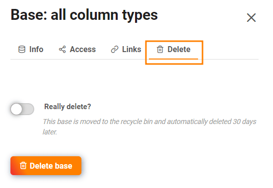

Si eres **administrador de un** equipo, tienes acceso a todas las bases de tu equipo a través de la **administración** del equipo. Puede acceder a la vista detallada de las bases individuales, ver las participaciones y enlaces de las bases o eliminar bases.

## Para acceder a las bases en la administración del equipo

1. Haz clic en la **imagen de** tu **avatar** en la esquina superior derecha.
2. Seleccione **Gestión de equipos** en el menú desplegable.
3. Vaya a **Bases** en el lado izquierdo bajo **Navegación**.
4. Haga clic en una **base** para obtener más información y opciones para esa base.

## Qué se puede ver en la vista detallada de una base

### Área de información

Aquí puede leer la siguiente **información**:

- Nombre base
- Base ID
- Fecha de creación
- Propietario de la base
- Número de líneas dentro de la base

Puede **exportar** la **base** seleccionada haciendo clic en el botón correspondiente.

### Acceda a

Aquí puedes ver todos los **miembros** que tienen **acceso a** esta base y si tienen **permisos de lectura o escritura**.

### Enlaces

En **Enlaces** puede ver todos los enlaces generados para la base seleccionada.

### Borrar

En **Borrar** tiene la opción de borrar la base seleccionada.

## La papelera

Todas las **bases borradas** aparecen en la papelera de reciclaje. Transcurridos **30 días**, las bases se eliminan automáticamente del sistema. Sin embargo, también puede **eliminar** manualmente **todas las** bases de la papelera de reciclaje. [Aquí](https://seatable.io/es/docs/teamverwaltung/den-papierkorb-in-der-teamverwaltung-leeren/) encontrará información sobre cómo hacerlo.

Para restaurar una base, haga clic en la base correspondiente y accione el control deslizante antes de pulsar el botón **Restaurar base**.

## Libera

Aquí están los **Compartir usuarios y grupos** enumerados para todas las bases. Puede ver **A quién** se liberó una base y que **Derecha** tienen los destinatarios del comunicado.



Obtenga más información sobre los tipos de desbloqueo en los siguientes artículos:

- [Liberar una base a un grupo](https://seatable.io/es/docs/freigabelinks/freigabe-einer-base-an-eine-gruppe/)
- [Crear un recurso compartido de usuario](https://seatable.io/es/docs/freigabelinks/anlegen-einer-benutzerfreigabe/)
- [Crear una acción personalizada](https://seatable.io/es/docs/berechtigungen/benutzerdefinierte-freigabe-erstellen/)

## Enlaces externos y enlaces de invitación

En estas dos vistas generales no sólo puede ver todos los enlaces externos y de invitación, sino también **cuántas veces** se han **llamado**, qué **derechos** otorgan a los destinatarios, **cuándo** se crearon, si están **protegidos por contraseña** o si ya han **caducado**.

Encontrará más información sobre los enlaces de liberación en los siguientes artículos:

- [Crear enlace de invitación]()
- [Crear un enlace externo para una base](https://seatable.io/es/docs/freigabelinks/externer-link-erklaert/)
- [Diferencias entre enlaces de invitación y enlaces externos](https://seatable.io/es/docs/freigabelinks/unterschiede-zwischen-einladungs-links-und-externen-links/)
