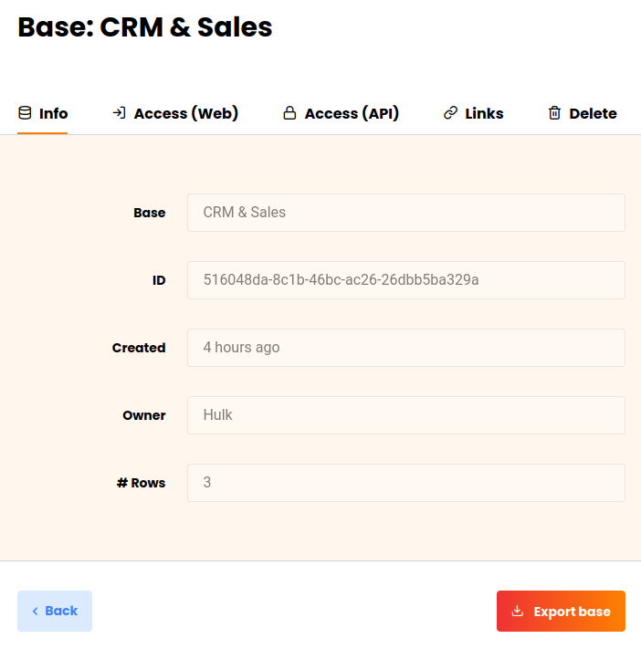
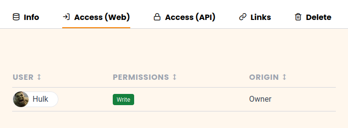
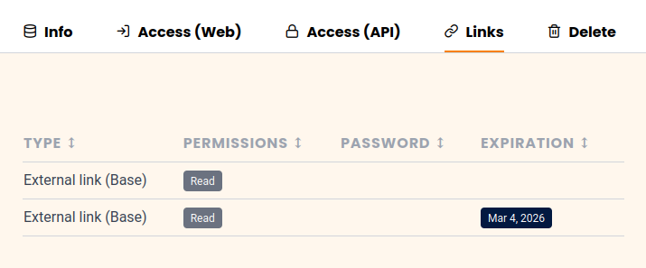

Si vous êtes **administrateur d'équipe**, vous avez accès à toutes les bases de votre équipe via l'**administration d'équipe**. Vous pouvez accéder à la vue détaillée de chaque base, voir les partages et les liens des bases ou supprimer des bases.

## Pour accéder aux bases dans l'administration d'équipe, procédez comme suit

1. Cliquez sur l'**image de** votre **avatar** dans le coin supérieur droit.
2. Sélectionnez l'option **Administration d'équipe** dans le menu déroulant.
3. Dans la **Navigation**, cliquez sur **Bases**.
    

4. Cliquez sur une **base** pour obtenir plus d'informations et d'options sur la base en question.

## Ce que vous pouvez voir dans la vue détaillée d'une base

### Zone d'information

Vous pouvez lire ici les **informations** suivantes :

- Nom de la base
- ID de base
- Date de création
- Propriétaire de la base
- Nombre de lignes dans la base

Vous pouvez **exporter** la **base** sélectionnée en cliquant sur le bouton correspondant.

### Accès (Web)

Vous pouvez voir ici tous les **membres** qui ont **accès** à cette base et s'ils disposent de **droits de lecture ou d'écriture**.

### Accès (API)

Si un ou plusieurs jetons API ont déjà été générés pour cette base, vous pouvez consulter les jetons API dans cette section.

### Liens

Dans les **liens**, vous pouvez voir tous les liens qui ont été générés pour la base sélectionnée.

### Supprimer

Sous **Supprimer**, vous avez la possibilité de supprimer la base sélectionnée.

## La corbeille à papier

Toutes les **bases supprimées** sont listées dans la corbeille. Après **30 jours**, les bases sont automatiquement supprimées du système. Mais vous avez aussi la possibilité de supprimer manuellement et **définitivement toutes les bases de la corbeille**. Pour savoir comment procéder, [cliquez ici]().

Pour restaurer une base, cliquez sur la base en question et actionnez le curseur avant de cliquer sur le bouton **Restaurer la base**.

## Communiqués

Voici les **Partage d'utilisateurs et de groupes** pour toutes les bases. Vous pouvez voir **à qui** une base a été libérée et quelle **Droits** avoir les destinataires de la validation.



Apprenez-en plus sur les types de partage dans les articles suivants :

- [Partage d'une base avec un groupe]()
- [Créer un partage d'utilisateurs]()
- [Créer un partage personnalisé]()

## Liens externes et liens d'invitation

Dans ces deux aperçus, vous pouvez voir non seulement tous les liens externes et d'invitation, mais aussi **le nombre de fois où** ils ont été **consultés**, les **droits** qu'ils donnent aux destinataires, **la date de** leur création, s'ils **sont protégés par un mot de passe** ou s'ils ont déjà **expiré**.

Vous trouverez plus d'informations sur les liens de partage dans les articles suivants :

- [Créer un lien d'invitation]()
- [Création d’un lien externe pour une base]()
- [Différences entre les liens d’invitation et les liens externes]()
