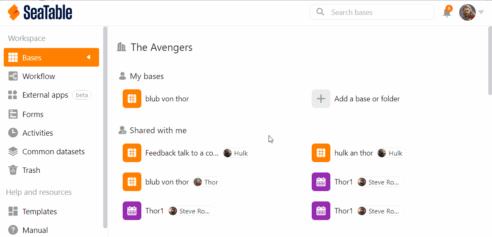
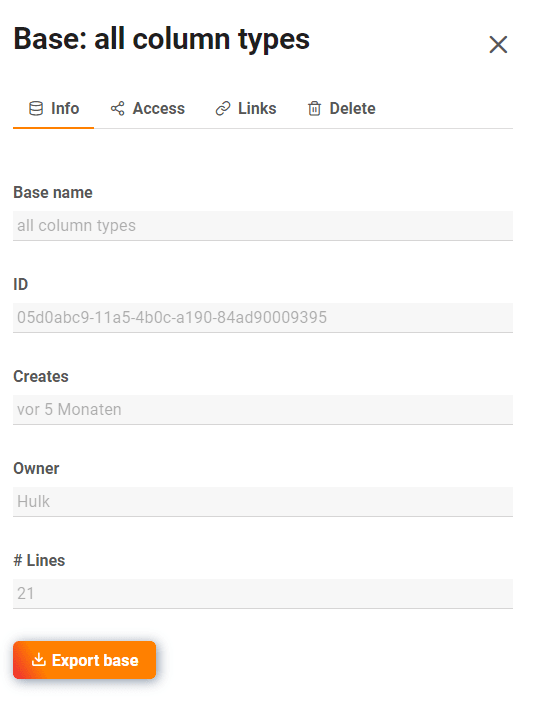
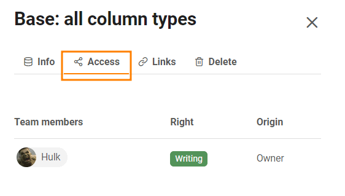
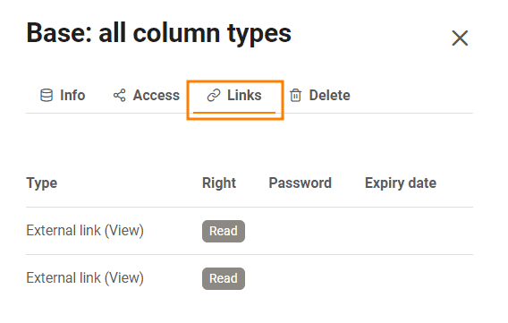
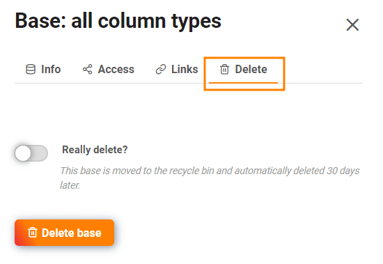

Se for **administrador de equipa**, tem acesso a todas as bases da sua equipa através da **administração da** equipa. Pode chamar a vista detalhada das bases individuais, ver acções e ligações das bases ou apagar bases.

## Para aceder às bases na administração da equipa

1. Clique na **imagem do** seu **avatar** no canto superior direito.
2. Seleccione **Gestão de Equipas** a partir do menu pendente.
3. Ir para **Bases** do lado esquerdo em **Navegação**.
4. Clique sobre uma **base** para obter mais informações e opções para essa base.

## O que se pode ver na vista detalhada de uma base

### Área de informação

Aqui pode ler as seguintes **informações**:

- Nome base
- ID base
- Data de criação
- Proprietário de base
- Número de linhas dentro da base

Pode **exportar** a **base** seleccionada, clicando no botão correspondente.

### Acesso

Aqui pode ver todos os **membros** que têm **acesso a** esta base e se têm **permissões de leitura ou de escrita**.

### Ligações

Em **Links** pode ver todos os links gerados para a base seleccionada.

### Eliminar

Em **Eliminar**, tem a opção de eliminar a base seleccionada.

## O cesto dos papéis

Todas as **bases eliminadas** estão listadas no caixote do lixo da reciclagem. Após **30 dias**, as bases são automaticamente removidas do sistema. No entanto, também pode **apagar** manualmente **todas as** bases do caixote do lixo da reciclagem. Pode descobrir como fazer isto [aqui]().

Para restaurar uma base, clicar na respectiva base e accionar o selector antes de clicar no botão **Restore Base**.

## Lançamentos

Aqui estão os **Partilha de utilizadores e grupos** listadas para todas as bases. Pode ver **A quem** foi lançada uma base e que **Certo** têm os destinatários da libertação.



Saiba mais sobre os tipos de lançamento nos artigos seguintes:

- [Lançamento de uma Base a um Grupo]()
- [Criação de uma partilha do utilizador]()
- [Criar partilha personalizada]()

## Ligações externas e ligações de convite

Nestas duas visões gerais, pode ver não só todas as ligações externas e de convite, mas também **quantas vezes** foram **chamadas**, que **direitos** dão aos destinatários, **quando** foram criadas, se estão **protegidas por palavra-passe** ou se já **expiraram**.

Mais informações sobre as ligações de lançamento podem ser encontradas nos artigos seguintes:

- [Criar link de convite]()
- [Criar uma ligação externa para uma base]()
- [Diferenças entre links de convite e links externos]()
