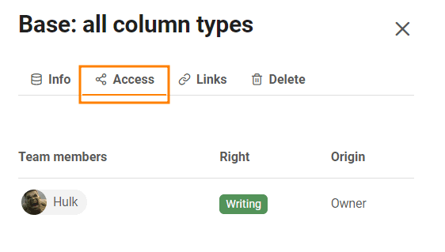

Если вы являетесь **администратором команды**, вы имеете доступ ко всем базам в вашей команде через **администрацию** команды. Вы можете вызвать детальный просмотр отдельных баз, просмотреть доли и ссылки баз или удалить базы.

## Чтобы получить доступ к базам в администрации команды

1. Нажмите на **изображение** своего **аватара** в правом верхнем углу.
2. Выберите **Управление командой** в выпадающем меню.
3. Перейдите в раздел **"Базы"** слева в разделе " **Навигация** ".
4. Нажмите на **базу**, чтобы получить дополнительную информацию и опции для этой базы.

## Что можно увидеть в детальном просмотре базы

### Информационная зона

Здесь вы можете ознакомиться со следующей **информацией**:

- Базовое название
- Идентификатор базы
- Дата создания
- Владелец базы
- Количество строк в базе

Вы можете **экспортировать** выбранную **базу**, нажав на соответствующую кнопку.

### Доступ

Здесь вы можете увидеть всех **пользователей**, имеющих **доступ к** этой базе, а также то, имеют ли они **права на чтение или запись**.

### Ссылки

В разделе **Ссылки** вы можете увидеть все ссылки, созданные для выбранной базы.

### Удалить

В разделе **Удалить** у вас есть возможность удалить выбранную базу.

## Корзина для мусора

Все **удаленные базы** попадают в корзину. По истечении **30 дней** базы автоматически удаляются из системы. Однако вы также можете **удалить все** базы в корзине вручную. Как это сделать, вы можете узнать [здесь](https://seatable.io/ru/docs/teamverwaltung/den-papierkorb-in-der-teamverwaltung-leeren/).

Чтобы восстановить базу, нажмите на соответствующую базу и управляйте ползунком, прежде чем нажать кнопку **Restore Base**.

## Релизы

Вот **Совместное использование пользователями и группами** указаны для всех баз. Вы можете увидеть **Кому** была выпущена база, которая **Справа** имеют получатели релиза.



Подробнее о типах релизов читайте в следующих статьях:

- [Освобождение базы для группы](https://seatable.io/ru/docs/freigabelinks/freigabe-einer-base-an-eine-gruppe/)
- [Создание общего ресурса пользователя](https://seatable.io/ru/docs/freigabelinks/anlegen-einer-benutzerfreigabe/)
- [Создание индивидуального релиза](https://seatable.io/ru/docs/berechtigungen/benutzerdefinierte-freigabe-erstellen/)

## Внешние ссылки и пригласительные ссылки

В этих двух обзорах можно увидеть не только все внешние и пригласительные ссылки, но и то, **как часто** они **вызывались**, какие **права** они дают получателям, **когда** они были созданы, **защищены** ли они **паролем** или **срок их действия** уже **истек**.

Более подробную информацию о ссылках на релиз можно найти в следующих статьях:

- [Создать пригласительную ссылку]()
- [Создание внешней ссылки для базы](https://seatable.io/ru/docs/freigabelinks/externer-link-erklaert/)
- [Различия между пригласительными и внешними ссылками](https://seatable.io/ru/docs/freigabelinks/unterschiede-zwischen-einladungs-links-und-externen-links/)
