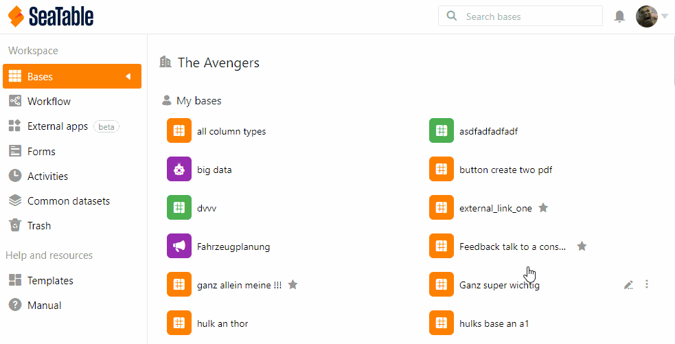

Nach **30 Tagen** werden gelöschte Bases **automatisch** aus dem System entfernt. Sie können die Bases aber auch **manuell** endgültig löschen, indem Sie den **Papierkorb in der Teamverwaltung leeren**.

1. Klicken Sie auf Ihr **Avatar-Bild** in der rechten oberen Ecke.
2. Wählen Sie aus dem Drop-down-Menü die Option **Teamverwaltung**.
3. Gehen Sie auf der linken Seite unter **Navigation** auf **Bases**.
4. Klicken Sie unter der Überschrift auf die Kategorie **Papierkorb**.
5. Scrollen Sie nach unten und klicken Sie auf **Alle Bases im Papierkorb endgültig löschen**.
