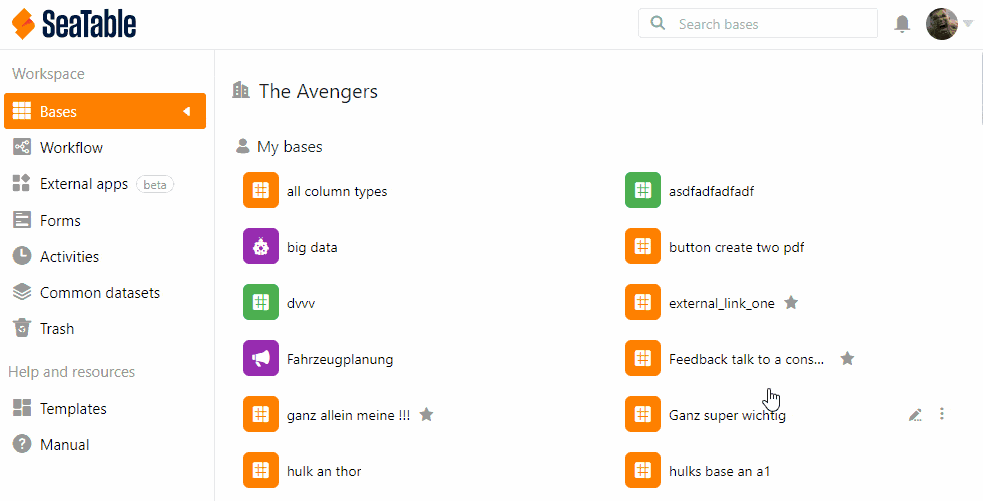

Após **30 dias**, as bases apagadas são **automaticamente** removidas do sistema. No entanto, também pode apagar permanentemente as bases **manualmente**, **esvaziando o caixote do lixo da reciclagem na administração da equipa**.

1. Clique na **imagem do** seu **avatar** no canto superior direito.
2. Seleccione **Gestão de Equipas** a partir do menu pendente.
3. Ir para **Bases** do lado esquerdo em **Navegação**.
4. Clique na categoria **Lixeira** sob o título.
5. Desça e clique em **Eliminar permanentemente todas as bases no caixote do lixo da reciclagem**.
