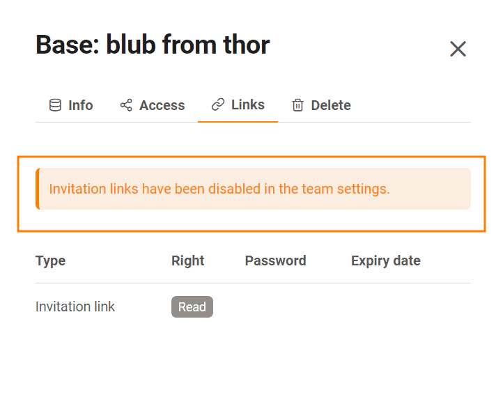

With an [invitation link](), you can give **read and write perm** issions for a **Base** to people outside your team, but they must log in to SeaTable.

You can learn how to create an invitation link [here.]() Since the link can be copied and forwarded as often as you like, it makes sense to set a password and an expiration date as **protective measures**.

In the **team administration**, you can [view]()) a [list of all invitation links for a base]()). In addition, as a **team administrator**, you can (de)activate the invitation link feature for other team members. In this way, you prevent or enable team members themselves from sharing bases with external third parties.

## To allow the base sharing via invitation link

1. Switch to the **team administration**.
2. Click on the **Team** menu item.
3. Click on the **Settings** category.
4. Activate the **Allow via invitation link** slider here **base sharing .**

## Effects of the active invitation link function

If you allow base sharing by invitation link, your team members can create as **many invitation links as they want** and send them to people outside the team, who can use the links to view or even edit the corresponding bases.

An invitation link can also be **duplicated** as many times as you want and gives everyone who has access to the link access to the **contents of Base**. If you want to restrict this sharing option, then uncheck the **Allowbase sharing by invitation link** slider. You will see the following message for the links:

Any **invitation links** previously created by the team will **no longer** **work.** You can still create invitation links, but the recipient will not have base access through them.


