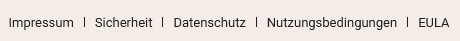

Como **administrador de un equipo**, puede ver varios **documentos legales** en la administración de equipos de SeaTable y descargarlos para sus archivos. Aquí encontrará, entre otras cosas, las **condiciones de uso** y la **política de privacidad**.

## Cómo encontrar los documentos jurídicos

1. Cambia a la **administración del equipo**.
2. Haga clic en la opción **"Legal** " de la sección de **navegación** de la izquierda.
3. Seleccione el documento que desea consultar de la lista de **documentos e información** jurídicos. Haga clic en **Descargar** o en **Enlace al sitio web**.

## Ver públicamente las condiciones de uso y la política de privacidad

Las Condiciones de uso y la Política de privacidad también están a disposición **del público** en nuestro sitio web SeaTable.io. Desplácese hasta la parte inferior de la página web y haga clic en Política de [privacidad]() o [Condiciones de uso, a la]() derecha del Aviso legal.

