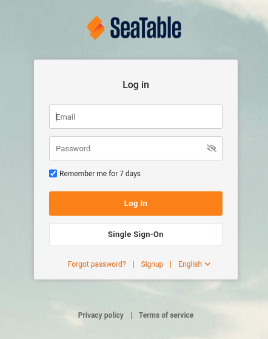



Avec l’introduction de [SeaTable 6.0 en novembre 2025](), les équipes disposant d’un abonnement Enterprise bénéficient d’une nouvelle fonctionnalité puissante : **l’authentification unique (SSO)**.

Cette fonctionnalité permet aux équipes de se connecter à SeaTable Cloud de manière beaucoup plus simple et sécurisée.

## Qu’est-ce que le SSO ?

L’authentification unique (SSO) est une méthode d’authentification où les utilisateurs se connectent une fois à un système central, le fournisseur d’identité (IdP), puis accèdent automatiquement à plusieurs services connectés — dans ce cas, SeaTable Cloud. Votre équipe profite de moins de problèmes de mots de passe, d’une sécurité renforcée et d’une gestion des utilisateurs simplifiée.

## Les trois principaux avantages du SSO

### Moins de problèmes de mots de passe

Avec le SSO, les utilisateurs n’ont besoin de retenir qu’un seul mot de passe — celui de leur fournisseur d’identité (IdP). Cela réduit le nombre d’identifiants à gérer et diminue la fatigue liée aux mots de passe, ce sentiment d’énervement causé par la multiplication des mots de passe. Cela évite aussi les erreurs dues aux oublis ou aux mauvaises pratiques comme noter ou réutiliser des mots de passe.

### Sécurité améliorée

Le SSO renforce la sécurité en centralisant la connexion via l’IdP. Des mécanismes modernes comme l’authentification multifactorielle y sont utilisables. Les identifiants ne sont plus stockés séparément pour chaque application, ce qui réduit les surfaces d’attaque. La liaison entre l’IdP et SeaTable garantit une authentification fiable et diminue le risque de mots de passe faibles.

### Gestion des utilisateurs simplifiée

Le SSO centralise la gestion des utilisateurs, ce qui la rend beaucoup plus simple. Les administrateurs d’équipe gèrent les comptes utilisateurs et les droits d’accès confortablement via l’IdP. Il est facile d’ajouter de nouveaux employés, et les processus d’intégration et de départ s’en trouvent accélérés. La fusion automatique des comptes utilisateurs lors de la première connexion via SSO évite également les doublons et fait gagner du temps.

## Qui peut utiliser le SSO ?

La fonctionnalité SSO est réservée **aux équipes disposant d’un abonnement Enterprise**. Chaque client Enterprise peut utiliser son propre IdP, offrant ainsi une flexibilité maximale pour l’intégration dans une infrastructure d’entreprise existante.

## Comment configurer

La configuration est réalisée par l’administrateur d’équipe dans la gestion des équipes SeaTable Cloud. Premièrement, une application et les paramètres correspondants doivent être créés dans l’IdP. Cette étape est techniquement simple et supportée par la plupart des fournisseurs d’identité modernes.

Un autre préalable indispensable est la vérification de la propriété du domaine via un enregistrement TXT dans le DNS du domaine email concerné. Ce n’est qu’après une vérification réussie que le domaine est officiellement lié à l’équipe SeaTable.

### Que signifie l’authentification de domaine ?

Une fois le domaine vérifié, tous les utilisateurs ayant une adresse email de ce domaine peuvent se connecter via SSO. Cela crée une séparation claire et une affectation automatique des utilisateurs à l’équipe.

### Fusion des comptes utilisateurs existants

Une particularité est la liaison automatique des comptes utilisateurs existants avec la connexion SSO lors de la première connexion. Aucun réglage ni donnée n’est perdu, les comptes sont fusionnés. Cela facilite grandement la transition.

### Options de connexion flexibles

Par défaut, les utilisateurs peuvent se connecter soit avec leur nom d’utilisateur et mot de passe précédents, soit avec le nouveau SSO après configuration. Ceci assure une transition en douceur. Pour renforcer la sécurité, l’administrateur d’équipe peut à tout moment imposer la connexion exclusivement via SSO.

## Avantages en bref

- Connexion considérablement simplifiée pour tous les membres de l’équipe
- Sécurité accrue grâce à l’authentification centralisée
- Intégration flexible avec un IdP propre
- Fusion automatique des comptes pendant la transition
- Gestion et contrôle améliorés par les administrateurs d’équipe

Avec le SSO dans SeaTable Cloud, vous bénéficiez d’un contrôle d’accès à la pointe de la technologie qui allie simplicité d’utilisation et sécurité — adapté aux besoins des entreprises modernes.
