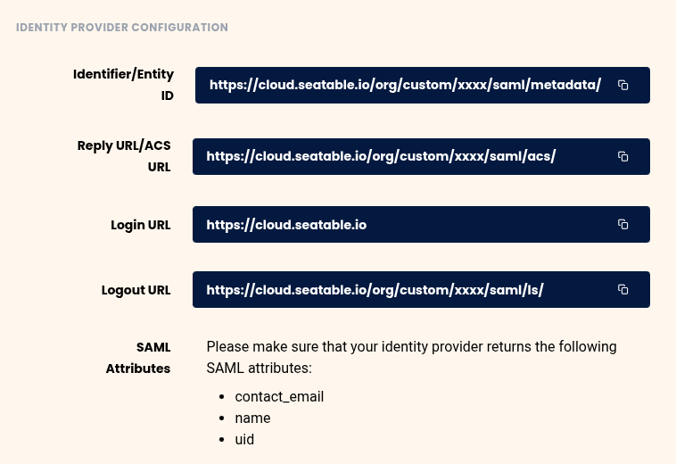
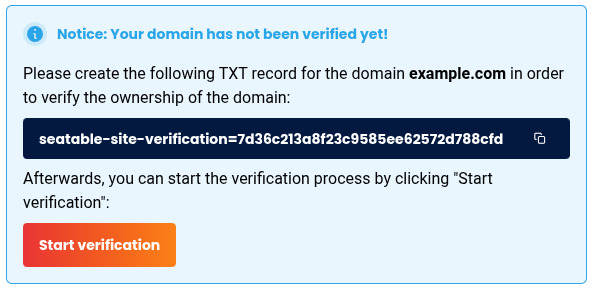



Please first log in to SeaTable Cloud and then navigate to the Team Management section. From there, go to **Teams > Settings > Single Sign-On**.  
The information displayed here will be required for your Identity Provider (IdP).

In the displayed URLs, your team ID will be shown instead of `xxxx`.

### 1. Create an application in your Identity Provider (IdP)

- Create a new application in your IdP for SeaTable Cloud.
- Use the URLs provided by SeaTable for:
    - Entity ID
    - Assertion Consumer Service (ACS) URL
    - Login (SSO URL)
    - Logout
- Make sure the metadata URL of your IdP is directly accessible and does not redirect to other domains.

### 2. Define SAML attributes

- Configure transmission of the following required attributes:
    - `contact_email`: user's email address
    - `name`: user's full name
    - `uid`: unique and persistent user identifier

### 3. Upload certificate and metadata URL in SeaTable

- Download the valid SAML certificate from your IdP.
- Upload the certificate and metadata URL to the SeaTable Team Management.
- Select the domain you want to associate with SeaTable Cloud.

### 4. Verify domain ownership

You will now see a DNS record in Team Management that you must add for the domain you just specified.

- Add the TXT record provided by SeaTable to your registered email domain's DNS settings.
- Wait a few minutes; DNS updates can sometimes take several hours.
- Start the **domain ownership verification**.
- Once verification succeeds, your domain will be linked to your SeaTable Cloud team.

### 5. Test login via SSO

Test login with a user from the verified domain. If a user account with that email already exists in your team, accounts will be merged.  
Currently, team members can log in using either SSO or their previous username and password.

### 6. Optional: Enforce login via SSO

If login via SSO works reliably, activate the option in Team Management to allow login only via SSO. This will disable previous username/password logins.
