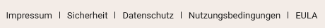

En tant qu'**administrateur d'équipe**, vous pouvez consulter plusieurs **documents juridiques** dans la gestion d'équipe de SeaTable et les télécharger pour vos dossiers. Vous y trouverez notamment les **conditions d'utilisation** et la **déclaration de confidentialité**.

## Comment trouver les documents juridiques

1. Passez à la **gestion d'équipe**.
2. Cliquez à gauche sous **Navigation** sur l'option **Mentions légales**.
3. Sélectionnez le document que vous souhaitez consulter dans la liste des **documents et informations juridiques**. Pour ce faire, cliquez sur **Télécharger** ou sur **Lien vers le site web**.

## Consulter publiquement les conditions d'utilisation et la déclaration de confidentialité

Les conditions d'utilisation et la déclaration de confidentialité sont également accessibles **au public** sur notre site web SeaTable.io. Faites défiler la page jusqu'au bas du site et cliquez sur [Protection des données](https://seatable.io/fr/datenschutz/) ou [Conditions d'utilisation](https://seatable.io/fr/nutzungsbedingungen/) à droite des mentions légales.

