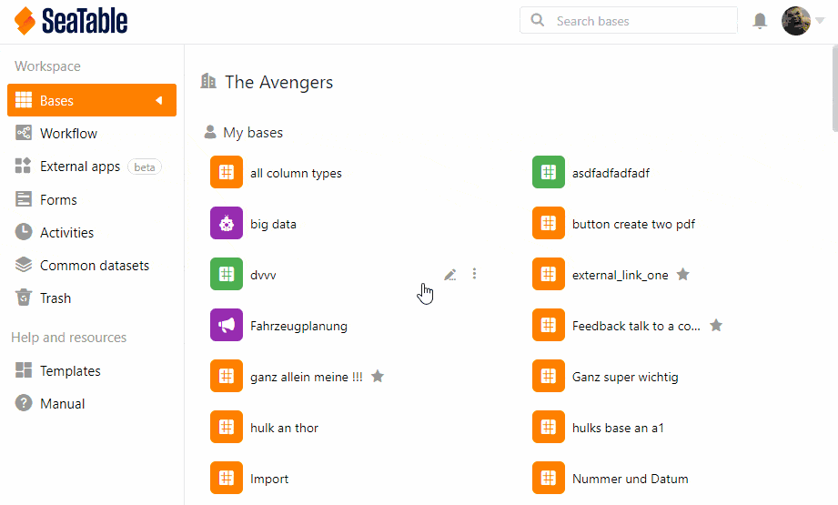



Als Team-Administrator können Sie in der **Teamverwaltung** den Namen Ihres Teams ändern.

## So ändern Sie den Teamnamen

1. Klicken Sie auf Ihr **Profil** in der rechten oberen Ecke.
2. Wählen Sie im Drop-down-Menü die Option **Teamverwaltung**.
3. Klicken Sie auf der linken Seite unter **Navigation** die Option **Team** an.
4. Klicken Sie auf **Einstellungen**. Diese Option finden Sie unterhalb der Überschrift.
5. Geben Sie den **Namen des Teams** ein.
6. Klicken Sie auf **Einstellungen speichern**.


