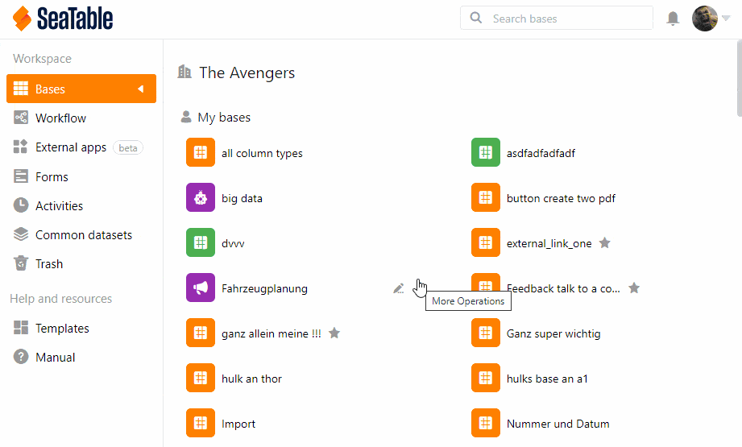
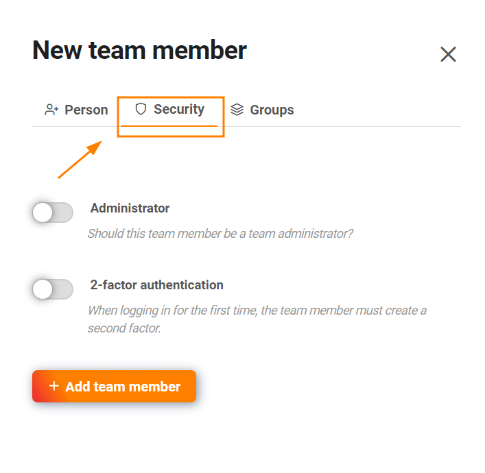
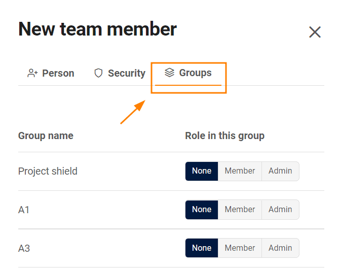

Как **администратор команды**, вы можете создавать новых членов команды через **администрацию команды**, не будучи уже зарегистрированным в SeaTable. В процессе создания вы уже можете назначить нового члена команды в начальные группы и выполнить настройки, связанные с безопасностью. После этого ваш новый сотрудник получит **данные для доступа по электронной почте** и сможет сразу же работать с вами.

## Добавить членов команды

1. Нажмите на свой **профиль** в правом верхнем углу.
2. Выберите **Управление командой** в выпадающем меню.
3. Нажмите на пункт меню **Команда** в разделе **Навигация**.
4. Нажмите на кнопку **Добавить члена команды**.
5. Откроется новое окно. Установите **имя пользователя**.
6. Введите **адрес электронной почты** человека, которого вы хотите добавить в качестве члена команды.
7. Задайте свой **собственный пароль** или сгенерируйте **автоматический пароль**, оставив ввод пустым.
8. Выберите **язык**, на котором будет написано письмо.
9. Нажмите кнопку **Добавить члена команды**.

{{< warning  headline="Внимание"  text="Вы **не можете** добавить **члена команды**, который уже создал другую учетную запись SeaTable с тем **же адресом электронной почты**. Чтобы создать учетную запись с таким адресом электронной почты, этот пользователь должен создать резервную копию всех своих данных (например, [экспортировать](https://seatable.io/ru/docs/historie-und-versionen/speichern-einer-base-als-dtable-datei/) их в [файл DTABLE](https://seatable.io/ru/docs/historie-und-versionen/speichern-einer-base-als-dtable-datei/)) и удалить свою предыдущую учетную запись. Подробнее об этом можно прочитать в статье [Можно ли объединить две учетные записи SeaTable?](https://seatable.io/ru/docs/haeufig-gestellte-fragen/kann-man-zwei-seatable-konten-zusammenfuehren/)" />}}

## Дополнительные опции при создании члена команды

Вы можете установить следующие **параметры безопасности**, активировав соответствующие элементы управления:

- Решите, должен ли ваш новый член команды стать **администратором** команды.
- Решите, должен ли новый член вашей команды проходить **двухфакторную аутентификацию**.

На вкладке **Группы** вы можете выбрать соответствующие группы и определить роль, которую новый член команды должен иметь в группе: **нет**, **член** или **администратор**. Если вы выбрали один из двух последних вариантов, вы добавляете нового члена команды в группы.


