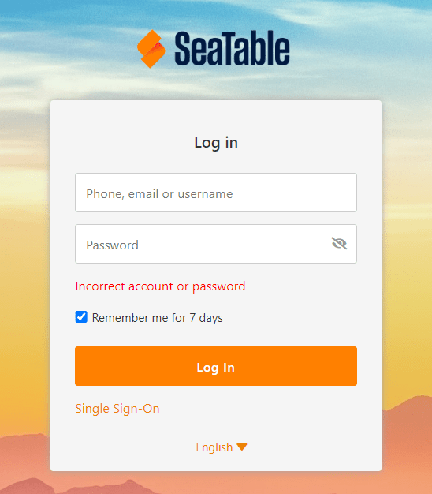

[Los miembros del equipo bloqueados](https://seatable.io/es/docs/teamverwaltung/ein-teammitglied-sperren-oder-loeschen/) ya no pueden conectarse y trabajar contigo. Sin embargo, como **administrador del equipo**, puedes desbloquearlos.

## Los miembros desactivados del equipo no pueden iniciar sesión

Si un miembro del equipo bloqueado o desactivado intenta iniciar sesión en SeaTable, aparecerá el siguiente mensaje de error:

Llegados a este punto, el miembro del equipo ya no puede hacer nada por sí mismo.

## Desbloqueo por el administrador del equipo

1. Cambia a la **administración del equipo**.
2. Haga clic en la opción de menú **Equipo**.
3. Seleccione el **miembro del equipo** bloqueado.
4. Desactive el control **Desactivar usuario**.

  
Una vez realizado el cambio **guardado** el miembro del equipo puede volver a iniciar sesión en la nube SeaTable o solicitar una nueva contraseña.
