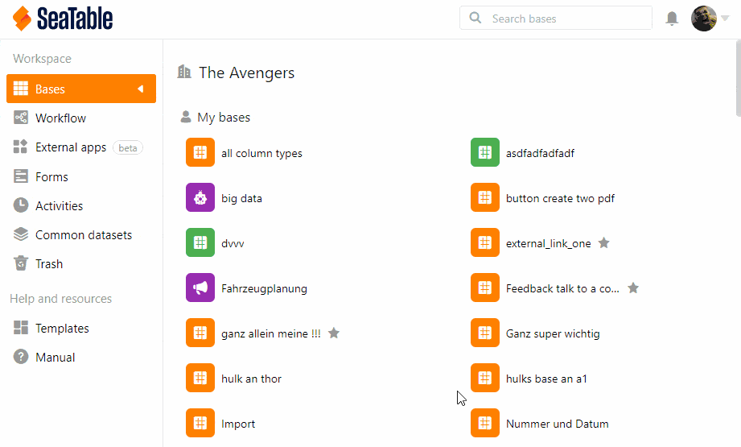
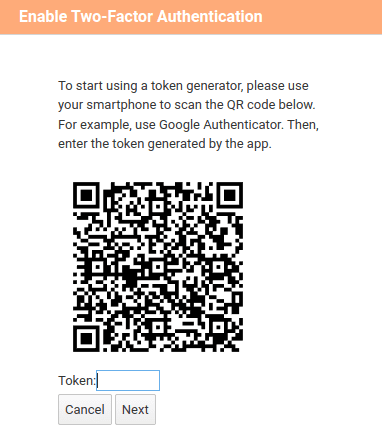

Durch die **Zwei-Faktor-Authentifizierung** können Sie neben dem persönlichen Passwort der Mitglieder eine zweite Sicherheitsbarriere festlegen. Zudem wird sichergestellt, dass nur jedes Teammitglied persönlich auf seinen Account zugreifen kann, selbst wenn eine andere Person das Passwort kennt.

## So stellen Sie die 2FA für alle Teammitglieder ein

1. Gehen Sie auf die **Teamverwaltung**.
2. Klicken Sie auf die Option **Team**.
3. Klicken Sie auf **Einstellungen**.
4. Schalten Sie den Regler **Erzwinge 2FA für alle Teammitglieder** an.
5. Klicken Sie auf **Einstellungen speichern**.

## Funktionsweise der Zwei-Faktor-Authentifizierung

SeaTable unterstützt die **Zwei-Faktor-Authentifizierung** zur verbesserten Absicherung Ihrer Accounts gegen Hacking-Versuche und Brute-Force-Angriffe. Bei der Zwei-Faktor-Authentifizierung wird beim Login neben Benutzername und Passwort noch ein zweiter Faktor eingefordert. Dieser zweite Faktor wird mithilfe einer App auf dem Smartphone des jeweiligen Teammitglieds erzeugt. Der zweite Faktor ist ein _sechsstelliger Zahlencode, der sich alle 30 Sekunden ändert_.

## Einrichtung der Zwei-Faktor-Authentifizierung

Sobald Sie die _Schutzfunktion aktiviert_ haben, müssen alle Teammitglieder beim nächsten Login einen _zweiten Faktor anlegen_. Dafür wird ein **QR-Code** generiert. Die Teammitglieder müssen mit einer Zwei-Faktor-App auf ihrem Smartphone den QR-Code abfotografieren, damit ihnen ein sechsstelliger Code angezeigt wird. Das sieht so aus:

Ihre Teammitglieder müssen die Zwei-Faktor-Authentifizierung einmalig einrichten. Dazu scannen sie den QR-Code mit ihrem jeweiligen Smartphone, wodurch eine Verknüpfung zwischen Smartphone und SeaTable hergestellt wird.

## Empfohlene 2FA-App für Ihr Smartphone

Grundsätzlich sollte jede App für die Zwei-Faktor-Authentifizierung funktionieren. Im folgenden Artikel finden Sie eine Übersicht über die bekanntesten Apps: https://www.datamate.org/die-7-besten-2fa-apps-fuer-android-und-ios/.

Unser persönlicher Favorit ist [2FA Authenticator](https://2fas.com/).


