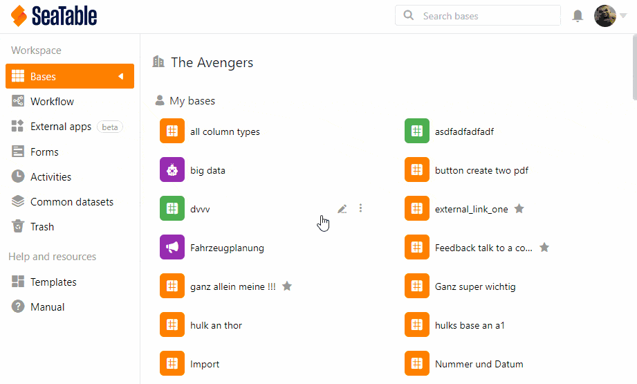



As a team administrator, you can change the name of your team in the **team administration**.

## To change the team name

1. Click on your **profile** in the upper right corner.
2. Select **Team administration** from the drop-down menu.
3. On the left side, under **Navigation**, click the **Team** option.
4. Click **Settings**. You will find this option below the heading.
5. Enter the **name of the team**.
6. Click **Save Settings**.


