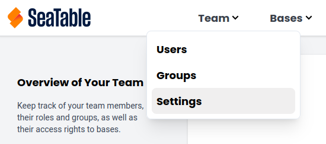
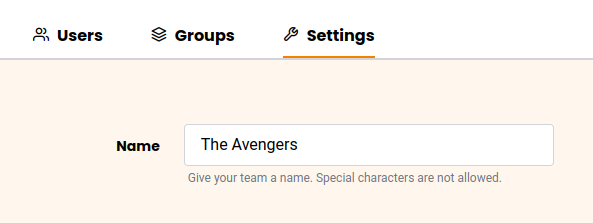



En tant qu'administrateur d'équipe, vous pouvez modifier le nom de votre équipe dans l'**administration d'équipe**.

## Comment modifier le nom de l'équipe

1. Cliquez sur votre **profil** dans le coin supérieur droit.
2. Sélectionnez l'option **Administration d'équipe** dans le menu déroulant.
3. Dans la **Navigation**, cliquez sur **Équipe** et sélectionnez la catégorie **Paramètres**.
    

4. Saisissez le **Nom de l'équipe**.
    
    
5. Cliquez sur **Enregistrer les paramètres**.


